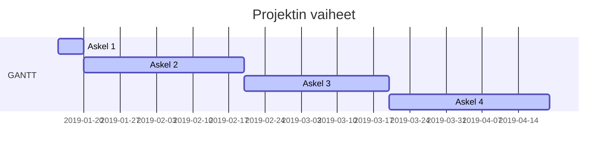

# Projektisuunnitelma

* [1. Toimeksianto](#1-Projektin-ja-lopputuotteen-kuvaus)
    *  1.1 - Tausta ja lähtökohdat
    *  1.2 - Tavoitteet ja tehtävät
    *  1.3 - Rajaus ja liittymät sekä tulos

* [2. Projektiorganisaatio](#2.Projektiorganisaatio)
    * 2.1 - organisaation esittely
    * 2.2 - vastuut ja päätöksentekoprosessi

* [3. Projektin vaiheet ja taloudelliset tavoitteet](#3.Projektin-ajalliset-tavoitteet)
    * 3.1 - tehtäväkokonaisuudet 
    * 3.2 - osittelu ja vaiheistus
    * 3.3 - välitulokset
    * 3.4 - aikataulut ja resurssissuunnitelmat 
    * 3.5 - budjetti

* [4. Laadun varmistus](#4.Laadunvarmistus)
    * 4.1 - menetelmät 
    * 4.2 - standardit 
    * 4.3 - hyväksymismenettely
    * 4.4 - muutosten hallinta
    * 4.5 - dokumentointi 
    * 4.6 - katselmoinnit 
    * 4.7 - riskien hallinta 
    * 4.8 - muut täydentävät suunnitelmat

* [5. Tiedonvälitys ja projektin etenemisen seuranta](#5.Tiedonvälitys-ja-projektin-etenemisen-seuranta-(viestintäsuunnitelma))
    * 5.1 - projektin aloitus
    * 5.2 - työtilat ja viestintävälineet
    * 5.3 - palaverikäytäntö ja yhteydenpito
    * 5.4 - raportointi ja tiedotus
    * 5.5 - projektikansio

* [6. Projektin päättyminen](#6.Projektin-päättyminen)
    * 6.1 - luovutus
    * 6.2 - käyttöönotto
    * 6.3 - ylläpito
    * 6.4 - projektin aineiston taltiointi
    * 6.5 - arkistointi
    * 6.6 - loppuraportti
    * 6.7 - projektin virallinen päättäminen

## 1 Projektin ja lopputuotteen kuvaus

”Tässä dokumentissa kuvataan X-projektin taustaa, tavoitteita, tehtäviä, vaihejakoa, resursseja ja organisaatiota. Vaihejaon yhteydessä on kuvattu jokainen vaihe erikseen lyhyesti.”

## 1.1 Tausta ja lähtökohdat

Projektin tavoitteena on tutustua yritysten tapoihin tuottaa projekteja ja tustuttaa opiskelijoita yritysten toimintamalleihin.
Projekti toteutetaan Jyväskylän ammattikorkeakoulun informaatioteknologian instituutin järjestämän <TTOS1000 Ohjelmistotuotanto> ‑opintojakson puitteissa.
Asiakkallaa ei tällä hetkellä ole toimivaa ratkaisua pyydetylle tuotteelle.

## 1.2 Tavoitteet ja tehtävät

Tavoitteena on tuottaa toimiva POC ratkaisu Tuhlari nimiselle palvelulle joka toimii tuotehallintarekisterinä.
Tuote tuotetaan yritykselle X.
”Projektiryhmä sopii eri tahojen kanssa suullisesti miten projektin etenemisestä ilmoitetaan.”

## 1.3 Rajaus ja liittymät

Projektin tuotosta ei tulla kaupallistamaan, vaan tuotos on oppimistarkoitukseen tarkoitettu jota nimeämätön yritys voi käyttää jatkojalostukseen halutessaan.

Yritys on pyytänyt että emme lähde toistaiseksi yrittämään luoda integraatiota muihin yrityksin järjestelmiin joita olisi jatkossa mahdollista tehdä yrityksen omasta toimesta.

Tässä myös täsmennetään ne tehtäväkokonaisuudet, jotka nyt tehtävään osioon tulevat vielä todennäköisesti jossain vaiheessa liittymään, mutta joita ei tämän projektin puitteissa kuitenkaan tulla toteuttamaan. Tyypillisiä tällaisia tehtäviä voisivat olla mm. käyttöympäristön rakentaminen ja koulutus. Muina rajauksina voisi olla esim. ohjelmiston käyttöliittymässä käytettävä kieli.

## 1.4 Oikeudet

”Eri osapuolten oikeudet on määritelty projektisopimuksessa.” Ellei erillisessä sopimuksessa ole kerrottu oikeuksista työn tuloksiin, tulee ne ilmaista esim. tässä projektisuunnitelmassa. 

## 1.5 Termit ja määritelmät

[CSC = TIETEEN TIETOTEKNIIKAN KESKUS OY](https://www.csc.fi/etusivu)

# 2. Projektiorganisaatio

## 2.1 Organisaation esittely

Projektin organisaation kuuluu yrityksen työntekijöitä ja toimeksiantajan edustajat. 

* Projektiryhmä edustajat
    * Markus Nylund
    * Reko Meriö
    * Mikko Martikainen
    * Kautto Elias

* Yrityksen edustajat
    * Annsi Ylönen
    * Markus Asikkainen

**Projektiryhmä**

Projektiryhmä suorittaa johtoryhmän projektille asettamat tehtävät käytettävissä olevien resurssien puitteissa.

**Johtoryhmä**

Johtoryhmän muodostavat siihen valitut projektiryhmän jäsenet sekä toimeksiantajan edustajat. 

**Tukiryhmä**

* Kuuva Pekka - (puhnro) - (M9015@student.jamk.fi)
* Lindgren Sami - (puhnro) - (M9016@student.jamk.fi)

Tukiryhmän jäsenet työstävät CI/CD Pipelineä gitlab ympäristöön sekä toimivat konsultteina projektina alkuvaiheessa.

## 2.2 Vastuut ja päätöksentekoprosessi

Projektin sisällä ei ole vastuita, toimimme luottamusperiaatteella.

# 3. Projektin ajalliset tavoitteet	

## 3.1 Osittaminen ja vaiheistus

* Askel 1. - Projektin aloitus
* Askel 2. - Projektin dokumentointi
* Askel 3. - Koodaus
* Askel 4. - Prototyyppi
* Askel 5. - Viimeistely
* Askel 6. - Projektin lopetus

## Askel 1. - Projektin aloitus

Projektin aloituksessa käymme läpi toimeksiantajan ongelmaa ja ratkaisupyyntöä.

## Askel 2. - Projektin dokumentointi

Projektin dokumentoinnissa teemme projektille vaatimusmäärrittelyn sekä käymme läpi vastaavia tarvittavia dokumentteja projektiin osallistuvien kanssa.

## Askel 3. - Koodaus

Projektin edetessä koodaus vaiheeseen aloitamme back- ja frontend devauksen sekä käymme läpi kirjoittamiamme määrittelyjä jatkojalostaen niitä.

## Askel 4. - Prototyyppi

Prototyyppi vaiheessa projektin ryhmällä on "noin" toimiva tuote joka voi peilata jo valmiin tuotteen toiminallisuutta antaen kuvaa sekä projektin jäsenille sekä asikkaalle ja vastaaville tahoille tuotteen toimivuudesta.

## Askel 5. - Viimeistely

Korjaamme mahdollisia löytyneitä bugeja jotka ilmenneet testaus vaiheessa joita ei vielä ole korjattu, hienostelemme myös tuotteen ulkonäköä tarvittaessa.

## Askel 6. - Projektin lopetus

Projekti ryhmä laattii loppuraportin. Projektiryhmä esittää tuotteen asiakkalle sekä projektin tuotos luovutetaan asiakkaalle. Projektiryhmä pitää myös viimeisen kokousen toimeksiantajan ja vastaavien tahojen kanssa.

> Projektin elinkaari voidaan jakaa erityyppisiin vaiheisiin. Kussakin vaiheessa tuotetaan määrätyt tuotteet, kuten selvitys, suunnitelmat, prototyyppi, laite jne. Kunkin vaiheen loppuun sovitaan arviointi, hyväksyntä tai katselmointi.

>sein edetään inkrementaalisesti eli ensin suunnitellaan ja toteutetaan yksi asia kokonaisuudessaan ennen kuin edetään seuraavaan asiakokonaisuuteen. Ei ole yhtä ainutta ”oikeaa” vaihejakoa, mutta jos toimeksiantajalla on oma menetelmänsä ja siihen liittyvät mallipohjat, niin opiskelijaprojekteissa käytetään ensisijaisesti niitä. Yhä useammin käytetään ketterää sovelluskehitystä eli ohjelmisto tehdään 1-4 viikon sprinteissä.

>Seuraavassa käydään jokainen vaihe, niiden vaatimat aikaresurssit ja tulokset läpi lyhyesti. Vaiheet ja niiden tehtävät kuvataan tarkemmin vaihesuunnitelmissa. Parhaillaan meneillään olevasta vaiheesta tulee olla tiedossa tarkasti kuka tekee ja kuinka paljon työtä tämän vaiheen tehtävien suorittamiseksi. Myöhempien vaiheiden työmääräarviot voidaan esittää alkuvaiheessa karkealla tasolla, jota sitten projektin edetessä tarkennetaan yksityiskohtaiselle tasolle. Tämä tapahtuu jokaisen vaiheen lopussa, jolloin suunnitellaan tarkemmin seuraava vaihe.

>Huom.: Seuraavassa on esitetty käynnistys- ja lopetusvaiheet. Kaikista projektin vaiheista, niiden kestoista ja työmääristä laaditaan myös nk. Gantt-kaavio (liitteenä), jossa näkyy myös vaiheiden väliset riippuvuudet ja tärkeimmät etapit (esim. johtoryhmän kokouspäivämäärät).

>Käynnistys p.k.vvvv – p.k.vvvv (X h)

>Projektin käynnistämiseen kuuluu olennaisesti projektisuunnittelu ja suunnitteludokumenttien laatiminen sekä yhteydenpitokäytänteiden luominen toimeksiantajayrityksen kanssa. Vaiheen aikana tehdään esim. ryhmän webbisivut, tutustutaan tarkemmin toimeksiantoon, aloitetaan kohdealueeseen perehtyminen ja laaditaan projektisuunnitelma yhteistyössä toimeksiantajan edustajien kanssa. Vaiheen aikana muodostetaan johtoryhmä, pidetään 1. johtoryhmän kokous sekä allekirjoitetaan projektisopimus.
”Vaiheen tuloksia ovat ryhmän imagon (nimi, logo ym.) luominen, webbisivut tms. sekä projektisopimus liitteineen.”

<Tähän oman projektinne vaiheet ja tehtävät>

Lopetus p.k.vvvv – p.k.vvvv (X h)

# 4. Laadunvarmistus

Projektissa sovellettavat työmenetelmät, välineet, ohjeet ja standardit

Tässä kappaleessa luetellaan kaikki käytettävät menetelmät, työkalut ja standardit versionumeroineen. Usein toimeksiantajalla on jokin menetelmä, jota projektiryhmän olisi syytä noudattaa. Toimeksiantaja voi määrittää myös noudatettavat dokumenttien ulkoasustandardit. Muussa tapauksessa projektiryhmä räätälöi IT-instituutin tarjoamista mallipohjista itselleen soveltuvan ja toimeksiantajan hyväksymän mallin.

Opintojakso asettaa siis tietyt vaatimukset projektin seurantatyökaluille ja raportoinnille, jotka tulee ottaa huomioon. Opintojaksolla ei kuitenkaan pakoteta tiettyä tapaa käyttää työkaluja, joten niiden käytöstä on syytä tehdä suunnitelma tähän kohtaan.

Projektin tiedon- ja versionhallinnan perusteet tulee selvittää, jotta kaikki projektin sidosryhmät tietävät dokumenttien uusimpien versioiden sijainnin. Projektisuunnitelmasta ja kaikista muistakin projektin keskeisistä dokumenteista tulee useita versioita, joihin pitää lisätä versiohistoria, jotta projektin kehityksen seuraaminen jälkikäteen on mahdollista. Mikäli jokin yksittäinen laite tai ohjelmisto nousee projektin toteutuksen kannalta kriittiseen asemaan, on tälle hyvä nimetä vastuuhenkilö, joka tuntee ko. laitteen tai ohjelmiston ryhmästä parhaiten. Ohessa on lista asioista, jotka kannattaa suunnitella ja dokumentoida: 

## 4.1 Väli- ja lopputulosten hyväksymismenettely

Tähän kirjataan se hyväksymismenettely, mikä projektissa on sovittu.

## 4.2 Muutosten hallinta

Kuvataan muutosten hallintaproseduuri projektinkäytäntöihin tai projektin tuloksiin liittyvien muutosten osalta. 

## 4.3 Dokumentointi

Kirjataan minne dokumentit tallennetaan/arkistoidaan, miten ne jaetaan ja kuka on vastuussa eri dokumenteista.

## 4.4 Riskien hallinta

Listataan riskit, arvioidaan niiden vakavuus ja todennäköisyys ja koetetaan miettiä toimenpiteet kuinka vakavimmat/todennäköisimmät riskit voitaisiin ehkäistä jo ennalta. Lisäksi olisi hyvä olla suunnitelma kuinka toimitaan, jos riski toteutuu.

Liitä seuraava osio tähän mukaan: [Riskienhallintataulukko]()

## 4.5 Katselmointikäytäntö

Luetellaan ja alustavasti aikataulutetaan projektin tuloskatselmukset laaditun toteutussuunnitelman pohjalta. Esitetään luettelomaisesti, mitä katselmuksia pidetään, alustava ajankohta, käsiteltävät asiat, osallistujat sekä käytännöt katselmointimateriaalin toimittamisesta (mitä, milloin, miten).

Linkit katselmointipöytäkirja pohjiin

## 4.6 Projektisuunnitelmaa täydentävät suunnitelmat

Tässä kohdassa mainitaan, mitä täydentäviä suunnitelmia on käytettävissä tai aiotaan projektin kuluessa laatia (esim. viestintä-, riskienhallinta-, testaus- ja käyttöönottosuunnitelma).

* Vaatimusmäärittely?
* Riskienhallintasuunnitelma
* Asiakkaan antama dokumentaatio?
* Viranoimaislähteet?
* 

## 4.7 Suunnitelmien tarkistus- ja päivitysajankohdat 

Projektisuunnitelman avulla reagoidaan poikkeamiin ja ympäristömuutoksiin, joten sitä päivitetään projektin aikana. Tähän kohtaan kirjataan ne ajankohdat, jolloin suunnitelman ajantasaisuus ainakin on tarkistettava.

## 4.8 Projektin keskeyttämiskriteerit

Oikeaoppiseen projektisuunnitelmaan kuuluu myös projektin keskeyttämiskriteerit. Näitä ei kuitenkaan opiskelijaprojekteissa käytetä, koska projekteissa käytetään tietty tuntimäärä tuloksen tekoon ja tulos luovutetaan sellaisena, kun se opintojakson päättyessä on. Projektiryhmä tekee kuitenkin jatkokehityssuunnitelman, josta mahdollinen uusi projekti jatkaa.

# 5. Tiedonvälitys ja projektin etenemisen seuranta (viestintäsuunnitelma)

Listaa projektissa sovitut työtilat ja viestintävälineet, palaverikäytäntö ja yhteydenpito, raportointi ja tiedotus.

# 6. Projektin päättyminen

## 6.1 Lopputuotteen luovutus, käyttöönotto

Projektin lopputuote tulee myös dokumentoida järkevällä tasolla. Osana lopputuotetta saattaa olla asiakkaalle tarjottavaa käyttöönottokoulutusta ja mahdollisesti asennus- tai käyttöönotto­palvelua. Mikäli koulutuksen rooli projektin kannalta on huomattava (esimerkiksi ohjelmiston käyttäjät eivät ole olleet mukana projektissa ja eivät tiedä miten järjestelmä toimii) tulee projektisuunnitelmaan liittää suunnitelma asiakkaalle tarjottavasta koulutuksesta. Lisäksi jos on tarpeen, tulee projektisuunnitelmaan liittää myös asennussuunnitelma ja käyttöönottosuunnitelma.

## 6.2 Projektin tuottaman aineiston taltiointi, arkistointi ja säilytysaika

”Projektiryhmien dokumentaatiosta IT-instituutille jäävä osa tallennetaan GitHubiin.” Toimeksiantajan tulee selkeästi määritellä, mitkä dokumentit voidaan jättää opiksi seuraaville projekteille. Tyypillisesti eri suunnitelmat ja loppuraportti ovat tällaisia dokumentteja. 

## 6.3 Projektin virallinen päättäminen

On tärkeää määritellä milloin, mihin tai miten projekti päättyy. Projektin päätös voi olla tietty päivämäärä, tietty tuotteen valmiusaste, tietty työtuntimäärä, tietty kulutettu rahasumma, kun asiakas ottaa tuotteen käyttöön, takuuaika on umpeutunut tai kun asiakas hyväksyy tuotteen.

”Projekti päättyy p.k.vvvv, jolloin projektisopimuksen voimassaoloaika päättyy.”

## 6.4 Lopetustilaisuus

Yleensä projektit päätetään yhteiseen päätösseminaariin. Tähän kirjataan osallistujat ja ajankohta. 

## 6.5 Projektin loppuraportti

Projektin loppuraportti laaditaan viimeiseen johtoryhmän kokoukseen mennessä.

## Liitteet

Projektisuunnitelmaa täydentävät suunnitelmat esitetään liitteenä.

