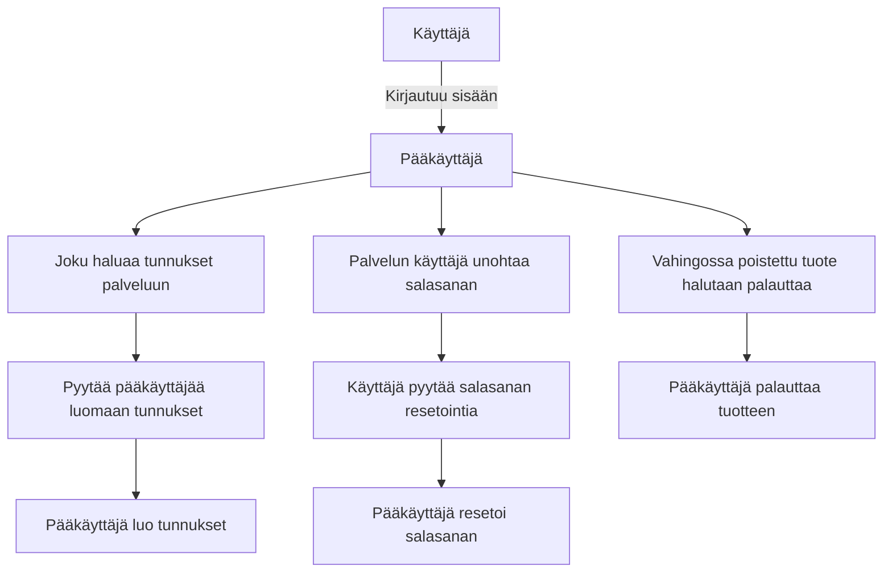
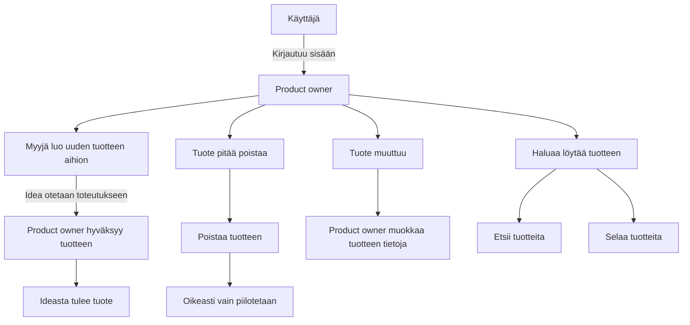
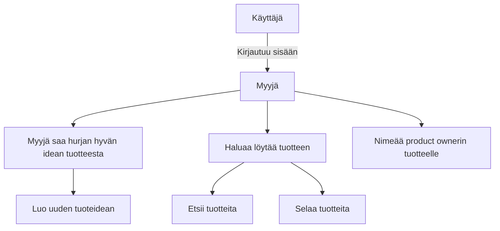
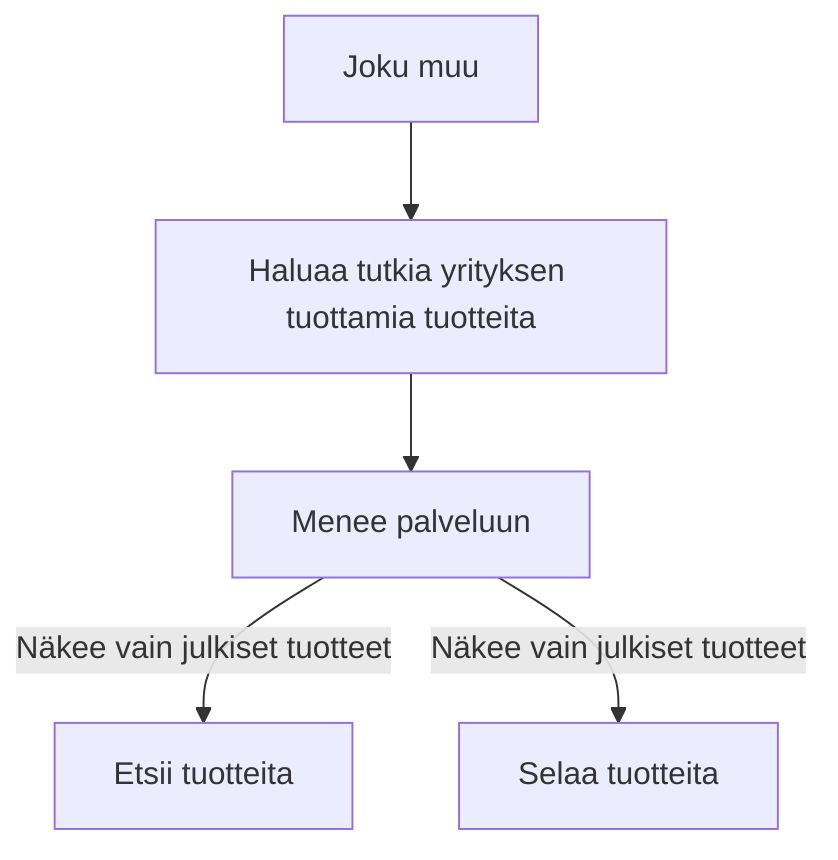

## Ohjelmiston/palvelun vaatimusmäärittely

Vaatimusmäärittely pohjan versio 1.1 - 24.4.2019

## TTOS1000 Kurssi TuHlaRi

* Reko Meriö - K9260
* Mikko Martikainen - K8936
* Elias Kautto - L4177
* Markus Nylund - L5392
* 2019
* Versionumero 0.3

## Sisällysluettelo 

* [Johdatus](#Johdatus)
* [Toimittaja](#Vaatimusmäärittelyn-toimittaja)
* [Palvelukuvaus](#Palvelukuvaus)
* [Yleinen sidosryhmäkuvaus]()
* [Sidosryhmäkuva](#Yleinen-sidosryhmäkuva-(Stakeholder--Map))
* [Valitut asikastarinat](#Valitut-asiakastarinat)
* [Alustavat User Story -kuvaukset]()
* [Yleinen käyttötapaus]()
* [Yleiset toiminnalliset vaatimukset]()
* [Yleiset ei-toiminnalliset vaatimukset]()
* [Palvelu MockUp](#Palvelu-MockUp-prototyyppi)
* [Tärkeimmät ominaisuudet](#Tärkeimmät-tunnistetut-ominaisuudet/piirteet-(Features))
* [Julkaisun suunnitelma](#Alustava-julkaisusuunnitelma)
* [Palvelun/ohjelmiston arkkitehtuuri](#[Palvelun/ohjelmiston-arkkitehtuuri])
* [Testaus ja laadunvarmistus](#Tunnistetut-riskit-ja-testikohteet)
* [Lähteet](#Dokumentit,-standardit-ja-lähteet)

## Johdatus

Kyseessä on kolmannen vuoden ohjelmistoprojekti, kurssitunnus TTOS1000 + TTOS1200.
Projektin tarkoituksena on käydä läpi ohjelmiston elinkaari suunnittelemalla, toteuttamalla ja testaamalla ohjelmisto.

## Vaatimusmäärittelyn toimittaja

Olemme tiimi nimeltä ReLamb.
4 JAMKin opiskelijaa tieto- ja viestintätekniikan linjalta.
Tavoitteemme on tehdä jokin toimiva ratkaisu toimeksiantoon.


## Palvelukuvaus

Palvelun pääasiallisena tehtävänä on toimia rekisterinä yrityksen tuotteille sekä tuoteideoille. Järjestelmään voidaan kirjata käyttäjiä erilaisissa rooleissa, jotka määrittelevät käyttäjän suhteen tuotteeseen. Järjestelmään voidaan lisätä, päivittää sekä hakea jo olemassaolevia tuotteita web-käyttöliittymän kautta. Myös muut käyttäjät voivat käyttää palvelun raportointiominaisuutta.

## Yleinen sidosryhmäkuva (Stakeholder -Map)


```plantuml
skinparam sequence {
	ArrowColor GreenYellow
	ActorBorderColor GreenYellow
	ActorBackgroundColor SpringGreen
	ActorFontColor Black
	ActorFontSize 17
	ActorFontName Aapex
}

skinparam usecase {
	BackgroundColor MediumSpringGreen
	BorderColor GreenYellow

	ArrowColor Lime
	ActorBorderColor black
	ActorFontName Courier
}

:Pääkäyttäjä:-right-->(Tuhlari) : Hallinnoi
:Product owner:-left-->(Tuhlari) : Luo tuotteita
:Myyjä/Business manager:-->(Tuhlari) : Luo tuoteideoita
:Joku muu:-up->(Tuhlari) : Selaa tuotteita

```


## Valitut sidosryhmät ja profiilit (Profiles/Stakeholders) 

* [Pääkäyttäjä](profiilikuvaukset/profiilikuvaus-pääkäyttäjä.md)
* [Myyjä](profiilikuvaukset/profiilikuvaus-myyja.md)
* [Product owner](profiilikuvaukset/profiilikuvaus-po.md)
* [Muu](profiilikuvaukset/profiilikuvaus-muu.md)


## Valitut asiakastarinat

* [Myyjä tarina 1](digiateam/core#32): Myyjä haluaa nimetä tuotteelleen Product Ownerin
* [General story 1](digiateam/core#31): Käyttäjä haluaa kirjautua palveluun
* [PO/myyjä tarina 1](digiateam/core#27): Käyttäjä haluaa luoda uuden tuotteen
* [PO tarina 2](digiateam/core#28): Käyttäjä haluaa poistaa tuotteen
* [PO tarina 3](digiateam/core#29): Käyttäjä haluaa muokata tuotteen tietoja
* [PO/myyjä tarina 4](digiateam/core#30): Käyttäjä haluaa etsiä palvelusta tuotteita
* [Pääkäyttäjä tarina 1](digiateam/core#23): Käyttäjä haluaa palauttaa toisen käyttäjän salasanan
* [Pääkäyttäjä tarina 2](digiateam/core#24): Käyttäjä haluaa luoda palveluun uudet tunnukset
* [Pääkäyttäjä tarina 3](digiateam/core#25): Käyttäjä haluaa muokata toisen käyttäjän tietoja
* [Pääkäyttäjä tarina 4](digiateam/core#26): Käyttäjä haluaa palauttaa vahingossa poistetun (piilotetun) tuotteen


## Palvelun tärkeimmät asiakaspolut (Customer Journey/Path)

#### Pääkäyttäjä



#### Product owner



#### Myyjä



#### Joku muu



## Tärkeimmät käyttötapaukset (General Use Cases)

```plantuml
left to right direction
skinparam sequence {
	ArrowColor GreenYellow
	ActorBorderColor GreenYellow
	ActorBackgroundColor SpringGreen
	ActorFontColor Black
	ActorFontSize 17
	ActorFontName Aapex
}

skinparam usecase {
	BackgroundColor MediumSpringGreen
	BorderColor GreenYellow

	ArrowColor Lime
	ActorBorderColor black
	ActorFontName Courier
}


:Ylläpitäjä:--(Tuotteiden etsiminen)
:Ylläpitäjä:--(Tuotteiden palauttaminen)
:Ylläpitäjä:--(Tuotteiden poistaminen)
:Ylläpitäjä:--(Salasanan palauttaminen)
:Ylläpitäjä:--(Käyttäjän luonti)
:Ylläpitäjä:--(Käyttäjätietojen muokkaus)

:Myyjä:--(Tuotteiden etsiminen)
:Myyjä:--(Tuoteidean luominen)
:Myyjä:--(Product ownerin nimeäminen)
:Myyjä:--(Tuoteidean muokkaaminen)


:Product owner:--(Tuotteiden etsiminen)
:Product owner:--(Tuotteen luominen)
:Product owner:--(Tuotteen poistaminen)
:Product owner:--(Tuotteen muokkaaminen)

:Joku muu:--(Tuotteiden etsiminen)

```


## Alustavat Käyttäjätarinat - User Story

Ohjelmistolla pitää pystyä lisäämään, muokkaamaan ja poistamaan tuotteita / tuoteideoita.
Tuotteita pitää pystyä selaamaan ja hakemaan käyttäjien oikeuksien mukaisesti.

## Ohjelmiston/palvelun tekniset vaatimukset 

| VaatimusID | Tyyppi | Kuvaus | Ominaisuus johon vaikuttaa |								
|:-:|:-:|:-:|:-:|
| SYSTEM-HW-REQ-0001 | System Technical Requirement | Back-endin tulee olla Docker kontissa |  |

## Arkkitehtuuriin/teknologiaan liityvät vaatimukset

| VaatimusID | Tyyppi | Kuvaus | Ominaisuus johon vaikuttaa |								
|:-:|:-:|:-:|:-:|
| ARCH-REQ-0001 | Technical Requirement | Palvelun tulee pyöriä Googlen tai CSC:n alustalla |  |

## Rajoitteet (Key Requirements and restrictions)

| Id | Vaatimuksen kuvaus | kategoria | Vastuullinen |
|:-:|:-:|:-:|:-:|
| CONSTRAINT-REQ-S0001 | Constrain | Palvelun tulee noudattaa GDPR:ää |  |

## Toiminnalliset vaatimukset (Functional Requirements)

| VaatimusID | Tyyppi | Kuvaus | Ominaisuus johon vaikuttaa |								
|:-:|:-:|:-:|:-:|
| FUNCTIONAL-REQ-C0001 | Functional Requirement | Käyttäjä voi kirjautua palveluun omilla tunnuksillaan. | [Kirjautuminen](dokumentit/02-vaatimusmaarittely/Ominaisuudet/ominaisuus-01-kirjautuminen.md) |
| FUNCTIONAL-REQ-C0002 | Functional Requirement | Pääkäyttäjä voi lisätä uusia käyttäjiä | [Käyttäjän luominen](Ominaisuudet/ominaisuus-07-kayttajan-luominen.md) |
| FUNCTIONAL-REQ-C0003 | Functional Requirement | Pääkäyttäjä voi muokata käyttäjien tietoja | [Käyttäjätietojen muokkaaminen](Ominaisuudet/ominaisuus-03-kayttajatietojen-muokkaus.md) |
| FUNCTIONAL-REQ-C0004 | Functional Requirement | Pääkäyttäjä voi palauttaa piilotetun tuotteen | [Tuotteen poistaminen](Ominaisuudet/ominaisuus-05-tuotteen-poistaminen.md) |
| FUNCTIONAL-REQ-C0005 | Functional Requirement | Myyjä voi lisätä tuoteidean | [Tuotteen luonti](Ominaisuudet/ominaisuus-02-tuotteen-luonti.md) |
| FUNCTIONAL-REQ-C0006 | Functional Requirement | Myyjä ja PO voi etsiä tuotteita rekisteristä. | [Tuotteen hakeminen](Ominaisuudet/ominaisuus-04-tuotteiden-hakeminen.md) |
| FUNCTIONAL-REQ-C0007 | Functional Requirement | Myyjä voi muokata tuoteideoidensa tietoja. | [Tuotteen muokkaaminen](Ominaisuudet/ominaisuus-06-tuotteen-muokkaaminen.md) |
| FUNCTIONAL-REQ-C0008 | Functional Requirement | PO voi lisätä tuotteen eli hyväksyä tuoteidean. | [Tuotteen muokkaaminen](Ominaisuudet/ominaisuus-06-tuotteen-muokkaaminen.md) |
| FUNCTIONAL-REQ-C0009 | Functional Requirement | PO voi muokata tuotteidensa tietoja. | [Tuotteen muokkaaminen](Ominaisuudet/ominaisuus-06-tuotteen-muokkaaminen.md) |
| FUNCTIONAL-REQ-C0010 | Functional Requirement | PO voi poistaa eli piilottaa tuotteen. | [Tuotteen poistaminen](Ominaisuudet/ominaisuus-05-tuotteen-poistaminen.md) |
| FUNCTIONAL-REQ-C0011 | Functional Requirement | Käyttäjä voi etsiä julkisia tuotteita palvelusta | [Tuotteen hakeminen](Ominaisuudet/ominaisuus-04-tuotteiden-hakeminen.md) |

## Palveluun liittyvät tärkeimmät ei-toiminnalliset vaatimukset (Non Functional Requirements)

| VaatimusID | Tyyppi | Kuvaus | Ominaisuus johon vaikuttaa |								
|:-:|:-:|:-:|:-:|
| NON-FUNCTIONAL-REQ-C0001 | Non-Functional Requirement | Kirjautuessa käyttäjään yhdistetään varmenne | [Kirjautuminen](dokumentit/02-vaatimusmaarittely/Ominaisuudet/ominaisuus-01-kirjautuminen.md) |
| NON-FUNCTIONAL-REQ-C0002 | Non-Functional Requirement | Tuotetta lisättäessä tulee käyttäjälle ilmoittaa, jos pakolliseksi merkattu kenttä on tyhjä | [Tuotteen luonti](Ominaisuudet/ominaisuus-02-tuotteen-luonti.md) |
| NON-FUNCTIONAL-REQ-C0003 | Non-Functional Requirement | Kirjautuessa tulee käyttäjälle ilmoittaa, jos salasana ja käyttäjätunnus eivät täsmää | [Kirjautuminen](dokumentit/02-vaatimusmaarittely/Ominaisuudet/ominaisuus-01-kirjautuminen.md) |

### Suorituskyky (Performance)

| VaatimusID | Tyyppi | Kuvaus | Ominaisuus johon vaikuttaa |								
|:-:|:-:|:-:|:-:|
| PERFORMANCE-REQ-0001 | Non-Functional Performance | Kirjautumisen on oltava mahdollista yhtäaikaa 100 käyttäjällä (100 request/s) | [Kirjautuminen](dokumentit/02-vaatimusmaarittely/Ominaisuudet/ominaisuus-01-kirjautuminen.md) |
| PERFORMANCE-REQ-0002 | Non-Functional Performance | Hakutulosten tulee löytyä alle 2 sekunnissa | [Tuotteiden hakeminen](dokumentit/02-vaatimusmaarittely/Ominaisuudet/ominaisuus-04-tuotteiden-hakeminen.md) |


### Tietoturva

| VaatimusID | Tyyppi | Kuvaus | Ominaisuus johon vaikuttaa |								
|:-:|:-:|:-:|:-:|
| SECURITY-REQ-0001 | Non-Functional Security | Salasanassa on käytettävä vähintään MD5-tason salausta | [Kirjautuminen](dokumentit/02-vaatimusmaarittely/Ominaisuudet/ominaisuus-01-kirjautuminen.md) |								
| SECURITY-REQ-0002 | Non-Functional Security | Salasanan pituuden tulee olla vähintään 6 merkkiä | [Kirjautuminen](dokumentit/02-vaatimusmaarittely/Ominaisuudet/ominaisuus-01-kirjautuminen.md) |
| SECURITY-REQ-0003 | Non-Functional Security | Salasanassa tulee olla vähintään yksi numero | [Kirjautuminen](dokumentit/02-vaatimusmaarittely/Ominaisuudet/ominaisuus-01-kirjautuminen.md) |
| SECURITY-REQ-0004 | Non-Functional Security | Salasanassa tulee olla vähintään yksi iso kirjain | [Kirjautuminen](dokumentit/02-vaatimusmaarittely/Ominaisuudet/ominaisuus-01-kirjautuminen.md) |
| SECURITY-REQ-0005 | Non-Functional Security | Salasanassa tulee olla vähintään yksi pieni kirjain | [Kirjautuminen](dokumentit/02-vaatimusmaarittely/Ominaisuudet/ominaisuus-01-kirjautuminen.md) |
| SECURITY-REQ-0006 | Non-Functional Security | Yhteyden tulee olla salattu (HTTPS) | [Kirjautuminen](dokumentit/02-vaatimusmaarittely/Ominaisuudet/ominaisuus-01-kirjautuminen.md) |
| SECURITY-REQ-0007 | Non-Functional Security | Käyttäjä ei saa nähdä häneltä salattuja tietoja | [Tuotteen hakeminen](Ominaisuudet/ominaisuus-04-tuotteiden-hakeminen.md) |
| SECURITY-REQ-0008 | Non-Functional Security | Käyttäjän antama data täytyy tarkistaa SQL-injektioiden ja muiden hyökkäysten varalta |  |


### Käytettävyys

| VaatimusID | Tyyppi | Kuvaus |						
|:-:|:-:|:-:|
| USABILITY-REQ-0000 | Non-Functional Usability | Käyttöliittymän tulee olla suoraviivainen |

### Testattavuus/Ylläpidettävyys

| VaatimusID | Tyyppi | Kuvaus |								
|:-:|:-:|:-:|
| TESTABILITY-REQ-0000 | Non-Functional Testability | Jokaisella napilla on oltava uniikki id |	
| TESTABILITY-REQ-0001 | Non-Functional Testability | Koodin tulee olla hyvin dokumentoitu |


| Id | Vaatimuksen kuvaus | kategoria |
|:-:|:-:|:-:|
| MAINT-REQ00x | Koodin tulee olla kattavasti kommentoitu | Tekninen | 
| MAINT-REQ00x | Toimintalogiikasta tulee olla kaavioita | Tekninen | 
| MAINT-REQ00x | Rajapinnoista tulee olla selkeä dokumentaatio | Tekninen |


## Tärkeimmät tunnistetut ominaisuudet/piirteet (Features)

| Ominaisuus | Prioriteetti | Muuta |
| :-: | :-: | :-: |
| [Kirjautuminen](ominaisuudet/ominaisuus-01-kirjautuminen.md	) | Pakollinen | |
| [Tuotteen luonti](Ominaisuudet/ominaisuus-02-tuotteen-luonti.md) | Tärkeä | |
| [Käyttäjätietojen muokkaaminen](Ominaisuudet/ominaisuus-03-kayttajatietojen-muokkaus.md) | Tärkeä | |
| [Tuotteen hakeminen](Ominaisuudet/ominaisuus-04-tuotteiden-hakeminen.md) | Pakollinen | |
| [Tuotteen poistaminen](Ominaisuudet/ominaisuus-05-tuotteen-poistaminen.md) | Tärkeä | |
| [Tuotteen muokkaaminen](Ominaisuudet/ominaisuus-06-tuotteen-muokkaaminen.md) | Tärkeä | |
| [Käyttäjän luominen](Ominaisuudet/ominaisuus-07-kayttajan-luominen.md) | Tärkeä | |


## Palvelu MockUp-prototyyppi

https://www.figma.com/proto/B19e7eZ0SGsRlZsf30vf9g/Untitled?node-id=0%3A1&scaling=min-zoom


## Hyväksyntätestit


Testit löytyvät testlink-palvelusta.

## Alustava julkaisusuunnitelma

```plantuml
Project starts the 2019-11-4
[Project time] Starts 2019-11-4 and ends 2020-2-28
[Documentation] Starts 2019-11-4 and ends 2019-12-1
[Coding] Starts 2019-11-18 and ends 2020-2-11
[Testing] Starts 2019-11-25 and ends 2020-2-18
[End documentation] Starts 2020-2-18 and ends 2020-2-28
```

## Julkaistavat tuotekokonaisuudet (Konfiguraatio)

Seuraavassa taulukossa on esitelty eri versioissa julkaistavat ominaisuudet taulukon muodossa. 

**Demo 1**

| Ominaisuus | Versio | Testattavissa | Julkaistaan |
|:-:|:-:|:-:|:-:|
| [Kirjautuminen]() | 1.0 | - | - |
| [Tuotteen luonti]() | 1.0 | - | - |
| [Tuotteen hakeminen]() | 1.1 | - | - |
| [Käyttäjän luonti]() | 1.1 | - | - |

Seuraavassa julkaisussa on mukana muutamia parannettuja ominaisuuksia, jotka ovat kehittyneet eteenpäin. Näistä on valittu sopiva kokonaisuus asiakas julkaisuun.

**Demo 2**

| Ominaisuus | Versio | Testattavissa | Julkaistaan |
|:-:|:-:|:-:|:-:|
| [Tuotteen muokkas]() | 2.0 | - | - |
| [Käyttäjätietojen muokkaus]() | 2.1 | - | - |
| [Tuotteen poistaminen]() | 2.1 | - | - |


# [Palvelun/ohjelmiston arkkitehtuuri](https://gitlab.labranet.jamk.fi/digiateam/core/blob/master/dokumentit/03-suunnittelu-ja-toteutus/arkkitehtuuri-ja-tekninentoteutus.md) 


## Yleinen sijoittelunäkymä (Deployment diagram )

### Tietokantakuvaus (Database ER-diagram)

```plantuml
skinparam roundcorner 20
skinparam sequence {
	ArrowColor GreenYellow
	ActorBorderColor GreenYellow
	ActorBackgroundColor SpringGreen
	ActorFontColor Black
	ActorFontSize 17
	ActorFontName Aapex
}

skinparam class {
	BackgroundColor MediumSpringGreen
	BorderColor Yellow

	ArrowColor Lime
	ActorBorderColor black
	ActorFontName Courier
	FontSize 20
	AttributeFontSize 16
}

MongoDB *-- products
MongoDB *-- users

class MongoDB << (M, Silver) >>

class products << (P, Silver) >> {
 +int id
--
 +string name
--
 +string shortDesc
--
 +string longDesc
--
 +string logo
--
 +array[string] technologies
--
 +array[string] components
--
 +array[string] environmentRequirements
--
 +array[string] customer
--
 +int lifecycleStatus
--
 +int businessType
--
 +int pricing
--
 +bool isClassified
--
 +bool isIdea
}

class users << (U, Silver) >> {
  +int id
--
  +string name
--
  +string email
--
  +int userGroup

__ Encrypted __
  -string password
}

```

# Tunnistetut riskit ja testikohteet

* Salaisia tietoja näkyy henkilöille, joilla ei ole valtuuksia niiden näkemiseen.
* Käyttäjällä on liikaa oikeuksia

## Dokumentit, standardit ja lähteet


**Lähteet/Standardit/Suositukset**

| ID | Linkki |  |  
|:-:|:-:|:-:|
| JHS 165 ICT | http://www.jhs-suositukset.fi/c/document_library/get_file?uuid=b8118ad7-8ee4-459a-a12b-f56655e4ab9d&groupId=14 | Vaatimusmäärittely |
| SO 9241-11 | https://fi.wikipedia.org/wiki/K%C3%A4ytett%C3%A4vyys  | Käytettävyys | 
| ISO9001 | https://www.sfs.fi/julkaisut_ja_palvelut/tuotteet_valokeilassa/iso_9000_laadunhallinta/iso_9001_2015  | - | 
| - | -  | - | 
