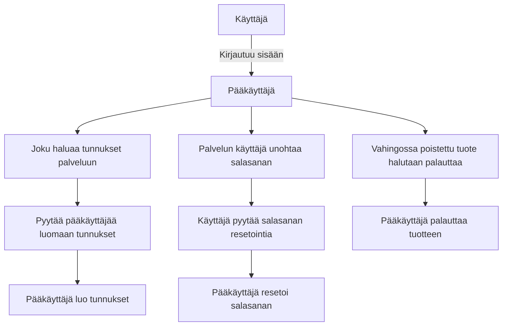
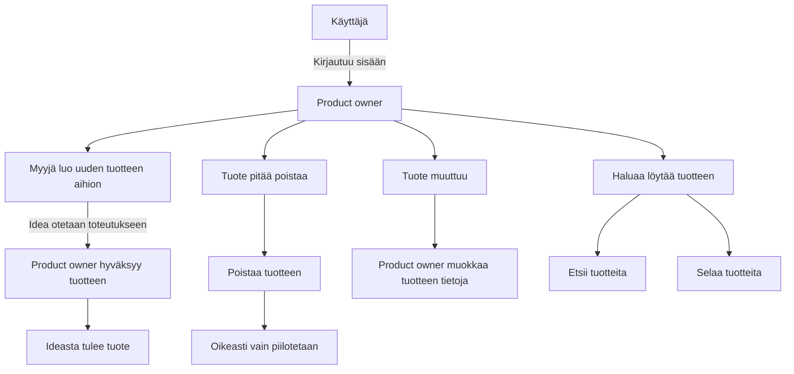
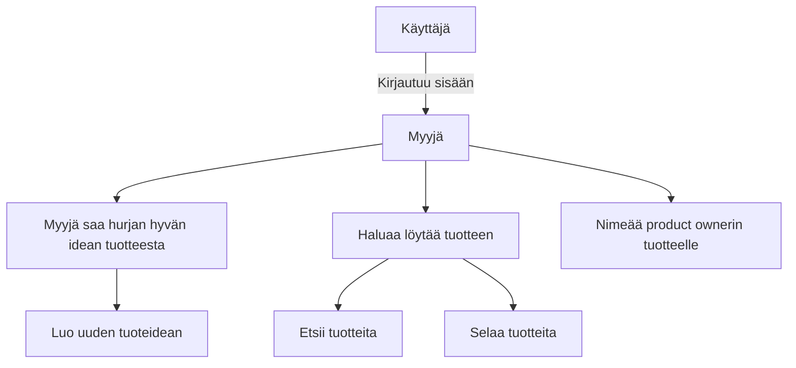
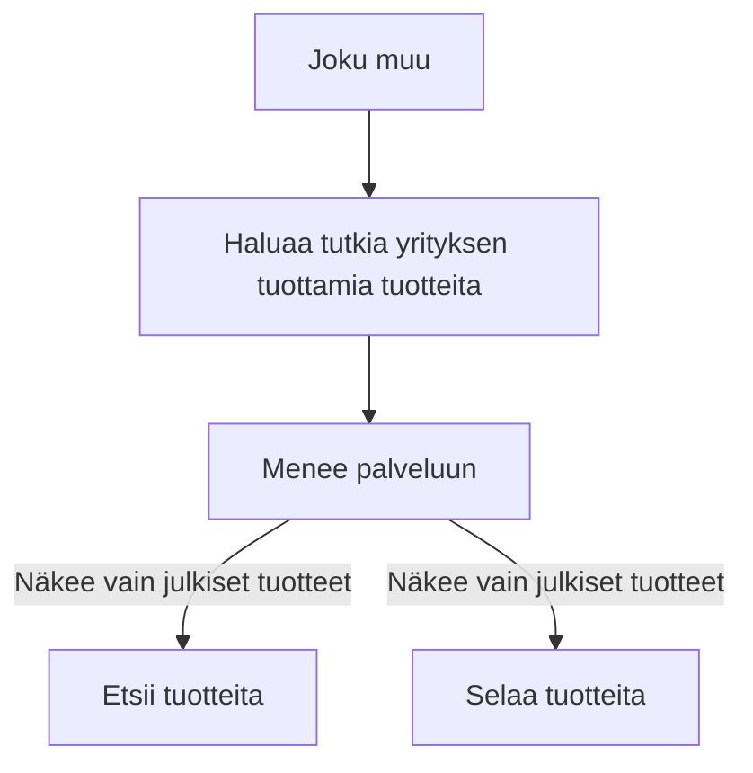

## Ohjelmiston/palvelun vaatimusmäärittely

Vaatimusmäärittely pohjan versio 1.1 - 24.4.2019

## TTOS1000 Kurssi TuHlaRi

* Reko Meriö - K9260
* Mikko Martikainen - K8936
* Elias Kautto - L4177
* Markus Nylund - L5392
* 2019
* Versionumero 0.1

## Sisällysluettelo 

**Pidä sisällysluettelo kunnossa, eli päivitä sitä tarpeen mukaan! Huomaa MarkDown-ankkurilinkitys**

* [Johdatus](#Johdatus)
* [Toimittaja](#Vaatimusmäärittelyn-toimittaja)
* [Palvelukuvaus](#Palvelukuvaus)
* [Yleinen sidosryhmäkuvaus]()
* [Asiakastarina](#Johdatus)
* [Sidosryhmät ja profiilikuvaukset]()
* [Sidosryhmäkuva]()
* [Palvelu/asiakaspolku]()
* [Alustavat User Story -kuvaukset]()
* [Yleinen käyttötapaus]()
* [Yleiset toiminnalliset vaatimukset]()
* [Yleiset ei-toiminnalliset vaatimukset]()
* [Palvelu MockUp]()
* [Tärkeimmät ominaisuudet]()
* [Julkaisun suunnitelma]()
* [Palvelun/ohjelmiston arkkitehtuuri]()
* [Testaus ja laadunvarmistus]()
* [Lähteet]()

## Johdatus

Kyseessä on kolmannen vuoden ohjelmistoprojekti, kurssitunnus TTOS1000 + TTOS1200.
Projektin tarkoituksena on käydä läpi ohjelmiston elinkaari suunnittelemalla, toteuttamalla ja testaamalla ohjelmisto.

## Vaatimusmäärittelyn toimittaja

Olemme tiimi nimeltä ReLamb.
4 JAMKin opiskelijaa tieto- ja viestintätekniikan linjalta.
Tavoitteemme on tehdä jokin toimiva ratkaisu toimeksiantoon.


## Palvelukuvaus

Palvelun pääasiallisena tehtävänä on toimia rekisterinä yrityksen tuotteille sekä tuoteideoille. Järjestelmään voidaan kirjata käyttäjiä erilaisissa rooleissa, jotka määrittelevät käyttäjän suhteen tuotteeseen. Järjestelmään voidaan lisätä, päivittää sekä hakea jo olemassaolevia tuotteita web-käyttöliittymän kautta. Myös muut käyttäjät voivat käyttää palvelun raportointiominaisuutta.

## Yleinen sidosryhmäkuva (Stakeholder -Map)


```plantuml
skinparam sequence {
	ArrowColor GreenYellow
	ActorBorderColor GreenYellow
	ActorBackgroundColor SpringGreen
	ActorFontColor Black
	ActorFontSize 17
	ActorFontName Aapex
}

skinparam usecase {
	BackgroundColor MediumSpringGreen
	BorderColor GreenYellow

	ArrowColor Lime
	ActorBorderColor black
	ActorFontName Courier
}

:Pääkäyttäjä:-right-->(Tuhlari) : Hallinnoi
:Product owner:-left-->(Tuhlari) : Luo tuotteita
:Myyjä/Business manager:-->(Tuhlari) : Luo tuoteideoita
:Joku muu:-up->(Tuhlari) : Selaa tuotteita

```


## Valitut sidosryhmät ja profiilit (Profiles/Stakeholders) 

>Valitaan aiemmin määritellystä sidosryhmäkuvauksesta tarkempaan tarkasteluun tärkeäksi koetut sidosryhmät/profiilit. Jokainen valittu sidosryhmä kuvataa itsenäisenä profiilikuvauksena ja tallennetaan omaksi tiedostokseen  

>Jokainen profiili kuvaus tallennetaan itsenäisenä tiedostona, koska tämä helpottaa tulevaisuudessa niihin viittaamista dokumentaatiossa esim. [Loppukäyttäjä - Keijo Korhonen](..pohjat/pohja-profiilikuvaus.md) 


* [Pääkäyttäjä](profiilikuvaukset/profiilikuvaus-pääkäyttäjä.md)
* [Myyjä](profiilikuvaukset/profiilikuvaus-myyja.md)
* [Product owner](profiilikuvaukset/profiilikuvaus-po.md)
* [Muu](profiilikuvaukset/profiilikuvaus-muu.md)


## Valitut asiakastarinat

>Valitaan tarvittava määrä eri sidosryhmiä/profiileja ja kirjoitetaan auki valitulle profiilille/sidosryhmälle "asiakastarina". Tavoitteena on kuvata sitä, miten valittu profiili/sidosryhmä käytännössä hyödyntää palvelua. Tavoite ei ole kehua sitä vaan käydä läpi syitä palvelun käyttöön ja miten se auttaa ko. sidosryhmää/profiilia.

>Muista kirjoittaa tarina auki pelkästään valitun sidosryhmän näkökulmasta (toiset sidosryhmät saattavat esiintyä tarinassa)

* [Myyjä tarina 1](digiateam/core#32): Myyjä haluaa nimetä tuotteelleen Product Ownerin
* [General story 1](digiateam/core#31): Käyttäjä haluaa kirjautua palveluun
* [PO/myyjä tarina 1](digiateam/core#27): Käyttäjä haluaa luoda uuden tuotteen
* [PO tarina 2](digiateam/core#28): Käyttäjä haluaa poistaa tuotteen
* [PO tarina 3](digiateam/core#29): Käyttäjä haluaa muokata tuotteen tietoja
* [PO/myyjä tarina 4](digiateam/core#30): Käyttäjä haluaa etsiä palvelusta tuotteita
* [Pääkäyttäjä tarina 1](digiateam/core#23): Käyttäjä haluaa palauttaa toisen käyttäjän salasanan
* [Pääkäyttäjä tarina 2](digiateam/core#24): Käyttäjä haluaa luoda palveluun uudet tunnukset
* [Pääkäyttäjä tarina 3](digiateam/core#25): Käyttäjä haluaa muokata toisen käyttäjän tietoja
* [Pääkäyttäjä tarina 4](digiateam/core#26): Käyttäjä haluaa palauttaa vahingossa poistetun (piilotetun) tuotteen


## Palvelun tärkeimmät asiakaspolut (Customer Journey/Path)

#### Pääkäyttäjä



#### Product owner



#### Myyjä



#### Joku muu



## Tärkeimmät käyttötapaukset (General Use Cases)

```plantuml
left to right direction
skinparam sequence {
	ArrowColor GreenYellow
	ActorBorderColor GreenYellow
	ActorBackgroundColor SpringGreen
	ActorFontColor Black
	ActorFontSize 17
	ActorFontName Aapex
}

skinparam usecase {
	BackgroundColor MediumSpringGreen
	BorderColor GreenYellow

	ArrowColor Lime
	ActorBorderColor black
	ActorFontName Courier
}


:Ylläpitäjä:--(Tuotteiden etsiminen)
:Ylläpitäjä:--(Tuotteiden palauttaminen)
:Ylläpitäjä:--(Tuotteiden poistaminen)
:Ylläpitäjä:--(Salasanan palauttaminen)
:Ylläpitäjä:--(Käyttäjän luonti)
:Ylläpitäjä:--(Käyttäjätietojen muokkaus)

:Myyjä:--(Tuotteiden etsiminen)
:Myyjä:--(Tuoteidean luominen)
:Myyjä:--(Product ownerin nimeäminen)
:Myyjä:--(Tuoteidean muokkaaminen)


:Product owner:--(Tuotteiden etsiminen)
:Product owner:--(Tuotteen luominen)
:Product owner:--(Tuotteen poistaminen)
:Product owner:--(Tuotteen muokkaaminen)

:Joku muu:--(Tuotteiden etsiminen)

```


## Alustavat Käyttäjätarinat - User Story

Ohjelmistolla pitää pystyä lisäämään, muokkaamaan ja poistamaan tuotteita / tuoteideoita.
Tuotteita pitää pystyä selaamaan ja hakemaan käyttäjien oikeuksien mukaisesti.

## Ohjelmiston/palvelun tekniset vaatimukset 

| VaatimusID | Tyyppi | Kuvaus | Ominaisuus johon vaikuttaa |								
|:-:|:-:|:-:|:-:|
| SYSTEM-HW-REQ-0001 | System Technical Requirement | Back-endin tulee olla Docker kontissa |  |

## Arkkitehtuuriin/teknologiaan liityvät vaatimukset

| VaatimusID | Tyyppi | Kuvaus | Ominaisuus johon vaikuttaa |								
|:-:|:-:|:-:|:-:|
| ARCH-REQ-0001 | Technical Requirement | Palvelun tulee pyöriä Googlen tai CSC:n alustalla |  |

## Rajoitteet (Key Requirements and restrictions)

| Id | Vaatimuksen kuvaus | kategoria | Vastuullinen |
|:-:|:-:|:-:|:-:|
| CONSTRAINT-REQ-S0001 | Constrain | Palvelun tulee noudattaa GDPR:ää | [Kirjautuminen ft1](ft1-ominaisuus.md) |

## Toiminnalliset vaatimukset (Functional Requirements)

| VaatimusID | Tyyppi | Kuvaus | Ominaisuus johon vaikuttaa |								
|:-:|:-:|:-:|:-:|
| FUNCTIONAL-REQ-C0001 | Functional Requirement | Käyttäjä voi kirjautua palveluun omilla tunnuksillaan. | [Kirjautuminen ft1](ft1-ominaisuus.md) |
| FUNCTIONAL-REQ-C0002 | Functional Requirement | Pääkäyttäjä voi lisätä uusia käyttäjiä ||
| FUNCTIONAL-REQ-C0003 | Functional Requirement | Pääkäyttäjä voi muokata käyttäjien tietoja ||
| FUNCTIONAL-REQ-C0004 | Functional Requirement | Pääkäyttäjä voi palauttaa piilotetun tuotteen ||
| FUNCTIONAL-REQ-C0005 | Functional Requirement | Myyjä voi lisätä tuoteidean ||
| FUNCTIONAL-REQ-C0006 | Functional Requirement | Myyjä ja PO voi etsiä tuotteita rekisteristä. ||
| FUNCTIONAL-REQ-C0007 | Functional Requirement | Myyjä voi muokata tuoteideoidensa tietoja. ||
| FUNCTIONAL-REQ-C0008 | Functional Requirement | PO voi lisätä tuotteen eli hyväksyä tuoteidean. ||
| FUNCTIONAL-REQ-C0009 | Functional Requirement | PO voi muokata tuotteidensa tietoja. ||
| FUNCTIONAL-REQ-C0010 | Functional Requirement | PO voi poistaa eli piilottaa tuotteen. ||
| FUNCTIONAL-REQ-C0011 | Functional Requirement | Käyttäjä voi etsiä julkisia tuotteita palvelusta ||

## Palveluun liittyvät tärkeimmät ei-toiminnalliset vaatimukset (Non Functional Requirements)

| VaatimusID | Tyyppi | Kuvaus | Ominaisuus johon vaikuttaa |								
|:-:|:-:|:-:|:-:|
| NON-FUNCTIONAL-REQ-C0001 | Non-Functional Requirement | Käyttäjä voi kirjautua palveluun omilla tunnuksillaan. | [Kirjautuminen ft1](ft1-ominaisuus.md) |
| NON-FUNCTIONAL-REQ-C0002 | Non-Functional Requirement | Pääkäyttäjä voi lisätä uusia käyttäjiä ||


### Suorituskyky? (Performance)

| VaatimusID | Tyyppi | Kuvaus | Ominaisuus johon vaikuttaa |								
|:-:|:-:|:-:|:-:|
| PERFORMANCE-REQ-0001 | Non-Functional Performance | Kirjautumisen on oltava mahdollista yhtäaikaa 100 käyttäjällä (100 request/s) | [Kirjautuminen ft1](ft1-ominaisuus.md) |
| PERFORMANCE-REQ-0002 | Non-Functional Performance | Hakutulosten tulee löytyä alle 2 sekunnissa ||


### Tietoturva?

| VaatimusID | Tyyppi | Kuvaus | Ominaisuus johon vaikuttaa |								
|:-:|:-:|:-:|:-:|
| SECURITY-REQ-0001 | Non-Functional Security | Salasanassa on käytettävä vähintään MD5-tason salausta | [Kirjautuminen ft1](ft1-ominaisuus.md) |								
| SECURITY-REQ-0002 | Non-Functional Security | Salasanan pituuden tulee olla vähintään 6 merkkiä ||
| SECURITY-REQ-0003 | Non-Functional Security | Salasanassa tulee olla vähintään yksi numero ||
| SECURITY-REQ-0004 | Non-Functional Security | Salasanassa tulee olla vähintään yksi iso kirjain ||
| SECURITY-REQ-0005 | Non-Functional Security | Salasanassa tulee olla vähintään yksi pieni kirjain ||
| SECURITY-REQ-0006 | Non-Functional Security | Yhteyden tulee olla salattu (HTTPS) ||
| SECURITY-REQ-0007 | Non-Functional Security | Käyttäjä ei saa nähdä häneltä salattuja tietoja ||
| SECURITY-REQ-0008 | Non-Functional Security | Käyttäjän antama data täytyy tarkistaa SQL-injektioiden ja muiden hyökkäysten varalta ||


### Käytettävyys

| VaatimusID | Tyyppi | Kuvaus | Ominaisuus johon vaikuttaa |								
|:-:|:-:|:-:|:-:|
| USABILITY-REQ-0000 | Non-Functional Usability | Käyttöliittymän tulee olla suoraviivainen |  [Kirjautuminen ft1](ft1-ominaisuus.md) | |	
| USABILITY-REQ-0001 | Non-Functional Usability | Tuotetta lisättäessä tulee käyttäjälle ilmoittaa, jos pakolliseksi merkattu kenttä on tyhjä ||
| USABILITY-REQ-0002 | Non-Functional Usability | Kirjautuessa tulee käyttäjälle ilmoittaa, jos salasana ja käyttäjätunnus eivät täsmää ||
| USABILITY-REQ-0003 | Non-Functional Usability |||
| USABILITY-REQ-0004 | Non-Functional Usability |||
| USABILITY-REQ-0005 | Non-Functional Usability |||

### Testattavuus/Ylläpidettävyys

| VaatimusID | Tyyppi | Kuvaus | Ominaisuus johon vaikuttaa |								
|:-:|:-:|:-:|:-:|
| TESTABILITY-REQ-0000 | Non-Functional Testability | Jokaisella napilla on oltava uniikki id ||	
| TESTABILITY-REQ-0001 | Non-Functional Testability | Koodin tulee olla hyvin dokumentoitu ||	
| TESTABILITY-REQ-0002 | Non-Functional Testability |||	
| TESTABILITY-REQ-0003 | Non-Functional Testability |||	
| TESTABILITY-REQ-0004 | Non-Functional Testability |||	
| TESTABILITY-REQ-0005 | Non-Functional Testability |||

| Id | Vaatimuksen kuvaus | kategoria | Vastuullinen |
|:-:|:-:|:-:|:-:|
| MAINT-REQ00x | Koodin tulee olla kattavasti kommentoitu | Tekninen | Kuka vastaa | 
| MAINT-REQ00x | Toimintalogiikasta tulee olla kaavioita | Tekninen | Kuka vastaa | 
| MAINT-REQ00x | Rajapinnoista tulee olla selkeä dokumentaatio | Tekninen | Kuka vastaa | 
| MAINT-REQ00x | Vaatimus? | Ylläpito | Kuka vastaa | 
| MAINT-REQ00x | Vaatimus? | Käytettävyys | Kuka vastaa | 


## Tärkeimmät tunnistetut ominaisuudet/piirteet (Features)

| Ominaisuus | Prioriteetti | Muuta |
| :-: | :-: | :-: |
| [Kirjautuminen](pohjat/pohja-ominaisuus.md) | Pakollinen | |
| [Tuotteiden etsiminen](pohjat/pohja-ominaisuus.md) | Tärkeä | |
| [Tuotteiden lisääminen](pohjat/pohja-ominaisuus.md) | Pakollinen | |
| [Tuotteiden muokkaaminen](pohjat/pohja-ominaisuus.md) | Tärkeä | |
| [Ominaisuus 5](pohjat/pohja-ominaisuus.md) | | |


## Palvelu MockUp-prototyyppi

https://www.figma.com/proto/B19e7eZ0SGsRlZsf30vf9g/Untitled?node-id=0%3A1&scaling=min-zoom


## Hyväksyntätestit

>Kiinnitetään alustavat hyväksyntätestit vaatimuksiin taulukon muodossa.

>Hyväksyntätesteissä keskitytään yleisesti asiakkaan/loppukäyttäjän näkökulmaan. Tavoitteena on kelpuuttaa, eli validoida , onko tuote asiakkaan toiveiden mukainen ja täyttääkö se asetetut vaatimukset.
Hyväksyntätesteillä voidaan selvittää onko tuote myös riittävän suorituskykyinen, käytettävä tai tietoturvallinen asiakkaiden käyttötarkoitukseen. 


| VaatimusID | Testitapaus | Kuvaus |  |								
|:-:|:-:|:-:|:-:|
| USE-CASE-007,SYSTEM-REQ-0001,SYSTEM-REQ-0004, SYSTEM-REQ-0012 | [Test Case Id X](Linkki testiin) | Hyväksyntätesti  |
| USE-CASE-017,SYSTEM-REQ-0011,SYSTEM-REQ-0004, SYSTEM-REQ-0012 | [Test Case Id Y](Linkki testiin) | Hyväksyntätesti  |
| USE-CASE-011,USE-CASE-013,SYSTEM-REQ-0204, SYSTEM-REQ-0212 | [Test Case Id Z](Linkki testiin) | Hyväksyntätesti  |
| USE-CASE-002,SYSTEM-REQ-0301,SYSTEM-REQ-0304, SYSTEM-REQ-0312 | [Test Case Id O](Linkki testiin) | Hyväksyntätesti  |

## Alustava julkaisusuunnitelma


> Julkaisusuunnitelman visualisoidulla muodolla on helpompi esittää ominaisuuksien julkaisut kehityksen aikanan.
Alla oleva kuva on luotu käyttäen PlantUML-työkalua. Sen avulla on luoto ns. Gantt-kaavio ominaisuuksien julkaisuajankohdista.

**Huomio** Alla oleva julkaisusuunnitelman kuva ei näy oikein vaatimusmäärittelydokumentin verkkojulkaisu-sivulla

>Oletamme, että tuotteessa on muutamia ominaisuuksia, joiden järjestys on mietitty ennakkoon..

```plantuml
Project starts the 2019-11-4
[Project time] Starts 2019-11-4 and ends 2020-2-28
```

## Julkaistavat tuotekokonaisuudet (Konfiguraatio)

>Tuotteen/ohjelmiston eri ominaisuuksista kehitetään usein eri versioita ja tämä johtaa usein erilaisiin tuotekokonaisuuksiin. Puhutaan ns. tuotekonfiguraatiosta, jonka avulla pyritään kiinnittämään eri 
ohjelmiston ominaisuusversiot yhteen version. 

Seuraavassa taulukossa on esitelty eri versioissa julkaistavat ominaisuudet taulukon muodossa. 


**Julkaisu "EarlyAdopter - Versio 1.0"**

| Ominaisuus | Versio | Testattavissa | Julkaistaan |
|:-:|:-:|:-:|:-:|
| [Feature 1]() | 1.0 | x.y.201z | x+2,y+3.201z |
| [Feature 2]() | 1.0 | x.y.201z | x+2,y+3.201z |
| [Feature 3]() | 1.1 | x.y.201z | x+2,y+3.201z |
| [Feature 4]() | 1.1 | x.y.201z | x+2,y+3.201z |
| [Feature 5]() | 2.3 | x.y.201z | x+2,y+3.201z |
| [Feature 6]() | 0.9 | x.y.201z | x+2,y+3.201z |
| [Feature 7]() | 1.1 | x.y.201z | x+2,y+3.201z |

Seuraavassa julkaisussa on mukana muutamia parannettuja ominaisuuksia, jotka ovat kehittyneet eteenpäin. Näistä on valittu sopiva kokonaisuus asiakas julkaisuun.

**Julkaisu "Enhanced - Versio 1.1"**

| Ominaisuus | Versio | Testattavissa | Julkaistaan |
|:-:|:-:|:-:|:-:|
| [Feature 1]() | 1.1 | x.y.201z | x+2,y+3.201z |
| [Feature 2]() | 1.1 | x.y.201z | x+2,y+3.201z |
| [Feature 3]() | 1.2 | x.y.201z | x+2,y+3.201z |
| [Feature 4]() | 1.4 | x.y.201z | x+2,y+3.201z |
| [Feature 5]() | 2.6 | x.y.201z | x+2,y+3.201z |
| [Feature 6]() | 1.2 | x.y.201z | x+2,y+3.201z |
| [Feature 7]() | 1.1 | x.y.201z | x+2,y+3.201z |


# Palvelun/ohjelmiston arkkitehtuuri 

>Millainen on tekninen toteutus ja miten eri teknologioita tullaan hyödyntämään. 


## Yleinen sijoittelunäkymä (Deployment diagram )

>Sijoittelunäkyvän avulla voi kuvata miten eri palvelu osat toimivat sen ollessa toiminnassa. 

### Tietokantakuvaus (Database ER-diagram)

```plantuml
skinparam roundcorner 20
skinparam sequence {
	ArrowColor GreenYellow
	ActorBorderColor GreenYellow
	ActorBackgroundColor SpringGreen
	ActorFontColor Black
	ActorFontSize 17
	ActorFontName Aapex
}

skinparam class {
	BackgroundColor MediumSpringGreen
	BorderColor Yellow

	ArrowColor Lime
	ActorBorderColor black
	ActorFontName Courier
	FontSize 20
	AttributeFontSize 16
}

MongoDB *-- products
MongoDB *-- users

class MongoDB << (M, Silver) >>

class products << (P, Silver) >> {
 +int id
--
 +string name
--
 +string shortDesc
--
 +string longDesc
--
 +string logo
--
 +array[string] technologies
--
 +array[string] components
--
 +array[string] environmentRequirements
--
 +array[string] customer
--
 +int lifecycleStatus
--
 +int businessType
--
 +int pricing
--
 +bool classified
}

class users << (U, Silver) >> {
  +int id
--
  +string name
--
  +string email
--
  +int userGroup

__ Encrypted __
  -string password
}

```

# Tunnistetut riskit ja testikohteet

* Salaisia tietoja näkyy henkilöille, joilla ei ole valtuuksia niiden näkemiseen.
* Käyttäjällä on liikaa oikeuksia

**Työkalu esimerkki**

* SWOT -analyysi?


### Dokumentit, standardit ja lähteet


**Lähteet/Standardit/Suositukset**

| ID | Linkki |  |  
|:-:|:-:|:-:|
| JHS 165 ICT | http://www.jhs-suositukset.fi/c/document_library/get_file?uuid=b8118ad7-8ee4-459a-a12b-f56655e4ab9d&groupId=14 | Vaatimusmäärittely |
| SO 9241-11 | https://fi.wikipedia.org/wiki/K%C3%A4ytett%C3%A4vyys  | Käytettävyys | 
| ISO9001 | https://www.sfs.fi/julkaisut_ja_palvelut/tuotteet_valokeilassa/iso_9000_laadunhallinta/iso_9001_2015  | - | 
| - | -  | - | 
