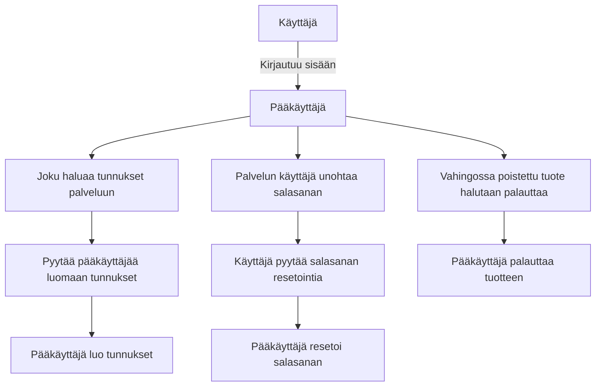
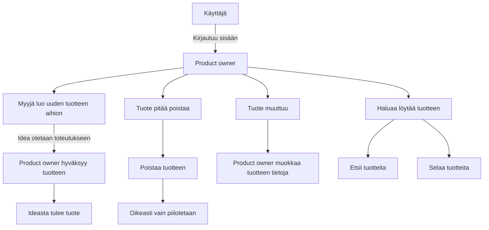
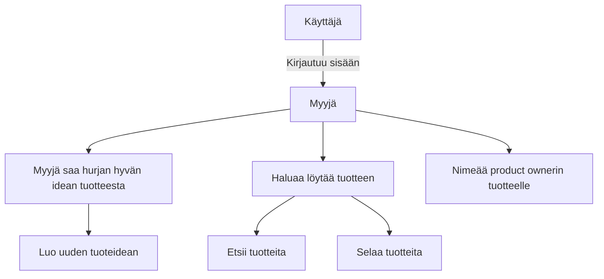
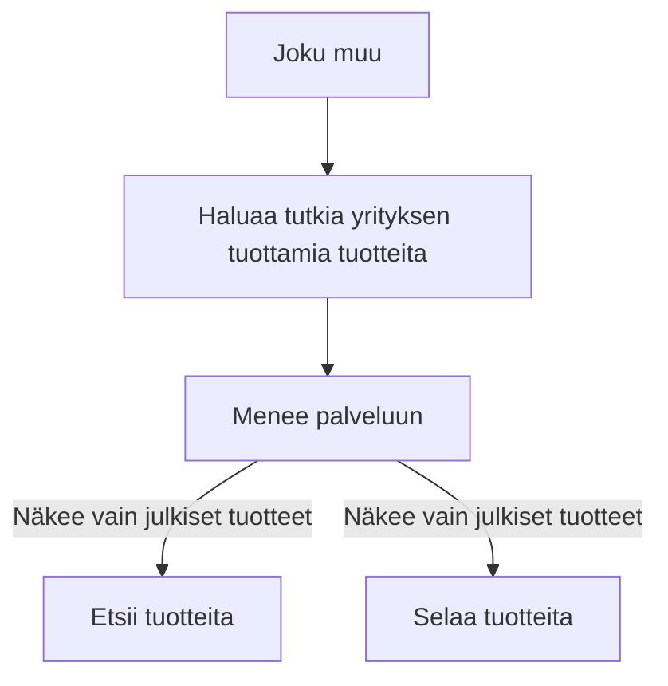

## Ohjelmiston/palvelun vaatimusmäärittely

Vaatimusmäärittely pohjan versio 1.1 - 24.4.2019

## TTOS1000 Kurssi TuHlaRi

* Reko Meriö - K9260
* -
* -
* -

* 2019
* Versionumero 0.1

## Sisällysluettelo 

**Pidä sisällysluettelo kunnossa, eli päivitä sitä tarpeen mukaan! Huomaa MarkDown-ankkurilinkitys**

* [Johdatus](#Johdatus)
* [Tilaaja](#Vaatimusmäärittelytyön toimeksiantaja/tilaaja)
* [Toimittaja](#Vaatimusmäärittelyn toimittaja)
* [Palvelukuvaus](#Palvelukuvaus)
* [Yleinen sidosryhmäkuvaus]()
* [Asiakastarina](#Johdatus)
* [Sidosryhmät ja profiilikuvaukset]()
* [Sidosryhmäkuva]()
* [Palvelu/asiakaspolku]()
* [Alustavat User Story -kuvaukset]()
* [Yleinen käyttötapaus]()
* [Yleiset toiminnalliset vaatimukset]()
* [Yleiset ei-toiminnalliset vaatimukset]()
* [Palvelu MockUp]()
* [Tärkeimmät ominaisuudet]()
* [Julkaisun suunnitelma]()
* [Palvelun/ohjelmiston arkkitehtuuri]()
* [Testaus ja laadunvarmistus]()
* [Lähteet]()

## Johdatus

>Kerro millaisesta projektista on kyse, hieman taustaa ja aiheeseen olennaisesti liittyviä asioita? Älä käytä harjoitustehtävässä tilaajien oikeita nimiä vaan muuta henkilötiedot ja toimeksiantajan viralliset tiedot


## Vaatimusmäärittelyn toimittaja

Olemme tiimi nimeltä ReLamb.
4 JAMKin opiskelijaa tieto- ja viestintätekniikan linjalta.
Tavoitteemme on tehdä jokin toimiva ratkaisu toimeksiantoon.


## Palvelukuvaus

>Mitä palvelun avulla voidaan tehdä? Mikä sen tehtävä on sidosryhmän kannalta? Kannattaa keskittyä loppukäyttäjiin tai oleellisiin palvelusta hyötyviin sidosryhmiin

Palvelu on tuoterekisteri tuotettujen ohjelmistojen seurantaan.
Palveluun voi lisätä uusia ohjelmistoja, muokata sekä poistaa niitä.


## Yleinen sidosryhmäkuva (Stakeholder -Map)


```plantuml
skinparam sequence {
	ArrowColor GreenYellow
	ActorBorderColor GreenYellow
	ActorBackgroundColor SpringGreen
	ActorFontColor Black
	ActorFontSize 17
	ActorFontName Aapex
}

skinparam usecase {
	BackgroundColor MediumSpringGreen
	BorderColor GreenYellow

	ArrowColor Lime
	ActorBorderColor black
	ActorFontName Courier
}

(Pääkäyttäjä)-right->Tuhlari
(Product owner)-left->Tuhlari
(Myyjä/Business manager)-->Tuhlari
(Joku muu)-up->Tuhlari

```


## Valitut sidosryhmät ja profiilit (Profiles/Stakeholders) 

>Valitaan aiemmin määritellystä sidosryhmäkuvauksesta tarkempaan tarkasteluun tärkeäksi koetut sidosryhmät/profiilit. Jokainen valittu sidosryhmä kuvataa itsenäisenä profiilikuvauksena ja tallennetaan omaksi tiedostokseen  

>Jokainen profiili kuvaus tallennetaan itsenäisenä tiedostona, koska tämä helpottaa tulevaisuudessa niihin viittaamista dokumentaatiossa esim. [Loppukäyttäjä - Keijo Korhonen](..pohjat/pohja-profiilikuvaus.md) 

**Muista kirjata kuvauksiin erityisesti sidosryhmän motivaatio! Eli miksi sidosryhmä syy käyttää/soveltaa palvelua**

* [Pääkäyttäjä](profiilikuvaukset/profiilikuvaus-pääkäyttäjä.md)
* [Myyjä](profiilikuvaukset/profiilikuvaus-myyja.md)
* [Product owner](profiilikuvaukset/profiilikuvaus-po.md)
* [Muu](profiilikuvaukset/profiilikuvaus-muu.md)


## Valitut asiakastarinat

>Valitaan tarvittava määrä eri sidosryhmiä/profiileja ja kirjoitetaan auki valitulle profiilille/sidosryhmälle "asiakastarina". Tavoitteena on kuvata sitä, miten valittu profiili/sidosryhmä käytännössä hyödyntää palvelua. Tavoite ei ole kehua sitä vaan käydä läpi syitä palvelun käyttöön ja miten se auttaa ko. sidosryhmää/profiilia.

>Muista kirjoittaa tarina auki pelkästään valitun sidosryhmän näkökulmasta (toiset sidosryhmät saattavat esiintyä tarinassa)

* [Myyjä tarina 1](digiateam/core#32): Myyjä haluaa nimetä tuotteelleen Product Ownerin
* [General story 1](digiateam/core#31): Käyttäjä haluaa kirjautua palveluun
* [PO/myyjä tarina 1](digiateam/core#27): Käyttäjä haluaa luoda uuden tuotteen
* [PO tarina 2](digiateam/core#28): Käyttäjä haluaa poistaa tuotteen
* [PO tarina 3](digiateam/core#29): Käyttäjä haluaa muokata tuotteen tietoja
* [PO/myyjä tarina 4](digiateam/core#30): Käyttäjä haluaa etsiä palvelusta tuotteita
* [Pääkäyttäjä tarina 1](digiateam/core#23): Käyttäjä haluaa palauttaa toisen käyttäjän salasanan
* [Pääkäyttäjä tarina 2](digiateam/core#24): Käyttäjä haluaa luoda palveluun uudet tunnukset
* [Pääkäyttäjä tarina 3](digiateam/core#25): Käyttäjä haluaa muokata toisen käyttäjän tietoja
* [Pääkäyttäjä tarina 4](digiateam/core#26): Käyttäjä haluaa palauttaa vahingossa poistetun (piilotetun) tuotteen


## Palvelun tärkeimmät asiakaspolut (Customer Journey/Path)

#### Pääkäyttäjä



#### Product owner



#### Myyjä



#### Joku muu




>Tarkennetaan tarinaa ja nostetaan oleelliset profiilit tarkasteluun palvelupolun näkökulmasta. 
Tämän "polun" tarkoituksena on kuvata sitä tapahtumien sarjaa joka käydään läpi palvelua käytettäessä. 
Palvelupolkuja voi olla useita, mutta tärkeintä on kuvata oleellisimmat aluksi. Palvelu polku kuvauksessa voidaan hyödyntää Swimlane/BluePrint/tilakone-kuvausta tai muuta sopivaksi katsottua visualisointi tapaa.
Tärkeää on kuvata polku ja käydä sen avulla eri vaiheet läpi


>Asiakaspolkukua on hyvä lähteä luonnostelemaan esim. asiakastarinan pohjalta. Polkuja kannattaa määritellä tarvittaessa useampia eri tilanteiden näkökulmasta. 
Yhteen kuvaukseen ei kannata upottaa liikaa tapahtumia


>Palvelupolkujen kuvaukseen voidaan hyödyntää myös erillisiä työkaluja. Mieti onko mahdollista hyödynnetään jotain ulkopuolista palvelua kuvauksen apuna?

**Työkalu esimerkkejä**

* [Canvanizer](https://canvanizer.com)

## Tärkeimmät käyttötapaukset (General Use Cases)

>**Käyttötapaukset** (Use Case) on hyvä erottaa **käyttötarkoituksesta** (Use Case)! Yleensä palvelusta ensi kertaa keskusteltaessa puhutaan sen eri käyttötarkoituksista, eli sitä
mihin ohjelmistoa/palvelua voidaan hyödyntää. Kun puhutaan palvelun määrittelystä käyttötapauksien kannalta on kyseessä eri asia. Käyttötapauksessa keskitytään 
tarkastelmaan palvelun käyttöä varsin rajatussa tilanteessa. On oleellista kirjata alkuvaiheessa tärkeimmät käyttötapaukset yhteen kuvaukseen. Tähän hyödynnetään UML- Use Case-diagrammia.

**Millaisia ovat tärkeimmät käyttötapaukset (Use Caset) tuotteeseen/palveluun liittyen? Muista, ettei käyttötapauksella ei tarkoiteta käyttökohdetta/soveltamiskohdetta**


>On hyvä kerätä tärkeimmät käyttötapaukset yhteen Use Case-kuvaukseen, josta on helpompi tarkastella järjestelmää. Laajemmassa järjestelmässä saattaa
olla useita satoja käyttötilanteita. 


```plantuml
left to right direction
skinparam usecase {
	BackgroundColor MediumSpringGreen
	BorderColor GreenYellow

	BackgroundColor<< Main >> YellowGreen
	BorderColor<< Main >> YellowGreen
	
	ArrowColor Lime
	ActorBorderColor black
	ActorFontName Courier
}

(Ylläpitäjä)--(Tuotteiden etsiminen)
(Ylläpitäjä)--(Tuotteiden palauttaminen)
(Ylläpitäjä)--(Tuotteiden poistaminen)
(Ylläpitäjä)--(Salasanan palauttaminen)
(Ylläpitäjä)--(Käyttäjän luonti)
(Ylläpitäjä)--(Käyttäjätietojen muokkaus)

(Myyjä)--(Tuotteiden etsiminen)
(Myyjä)--(Tuoteidean luominen)
(Myyjä)--(Product ownerin nimeäminen)
(Myyjä)--(Tuoteidean muokkaaminen)


(Product owner)--(Tuotteiden etsiminen)
(Product owner)--(Tuotteen luominen)
(Product owner)--(Tuotteen poistaminen)
(Product owner)--(Tuotteen muokkaaminen)

(Joku muu)--(Tuotteiden etsiminen)

```

* [Käyttötapaus 1 - Tilauksen muokkaus](../pohjat/pohja-kayttotapaus.md)
* [Käyttötapaus 2 - Tilauksen hyväksyntä](../pohjat/pohja-kayttotapaus.md)

## Alustavat Käyttäjätarinat - User Story

>**NYT HUOMIO!** Tähän kohtaan kannattaa keskittyä vasta kun kaikki muut osiot on käyty läpi! 
Kyseessä ei ole käyttäjätarina vaan ketterään kehittämiseen liittyvä Käyttötarina - User Story. 
Sen avulla kuvataan palveluun liittyvää toiminnallisuutta, joka halutaa siinä olevan.  

Esimerkki User Story issuesta #1 

## Ohjelmiston/palvelun tekniset vaatimukset 


**Teknisiä järjestelmävaatimuksia**

| VaatimusID | Tyyppi | Kuvaus | Ominaisuus johon vaikuttaa |								
|:-:|:-:|:-:|:-:|
| SYSTEM-HW-REQ-0001 | System Technical Requirement | Back-endin tulee olla Docker kontissa |  |

## Arkkitehtuuriin/teknologiaan liityvät vaatimukset

| VaatimusID | Tyyppi | Kuvaus | Ominaisuus johon vaikuttaa |								
|:-:|:-:|:-:|:-:|
| ARCH-REQ-0001 | Technical Requirement | Palvelun tulee pyöriä Googlen tai CSC:n alustalla |  |

## Rajoitteet (Key Requirements and restrictions)

| Id | Vaatimuksen kuvaus | kategoria | Vastuullinen |
|:-:|:-:|:-:|:-:|
| CONSTRAINT-REQ-S0001 | Constrain | Palvelun tulee noudattaa GDPR:ää | [Kirjautuminen ft1](ft1-ominaisuus.md) |


## Toiminnalliset vaatimukset (Functional Requirements)

| VaatimusID | Tyyppi | Kuvaus | Ominaisuus johon vaikuttaa |								
|:-:|:-:|:-:|:-:|
| FUNCTIONAL-REQ-C0001 | Functional Requirement | Käyttäjä voi kirjautua palveluun omilla tunnuksillaan. | [Kirjautuminen ft1](ft1-ominaisuus.md) |
| FUNCTIONAL-REQ-C0002 | Functional Requirement | Pääkäyttäjä voi lisätä uusia käyttäjiä ||
| FUNCTIONAL-REQ-C0003 | Functional Requirement | Pääkäyttäjä voi muokata käyttäjien tietoja ||
| FUNCTIONAL-REQ-C0004 | Functional Requirement | Pääkäyttäjä voi palauttaa piilotetun tuotteen. ||
| FUNCTIONAL-REQ-C0005 | Functional Requirement | Myyjä voi lisätä tuoteidean ||
| FUNCTIONAL-REQ-C0006 | Functional Requirement | Myyjä ja PO voi etsiä tuotteita rekisteristä. ||
| FUNCTIONAL-REQ-C0007 | Functional Requirement | Myyjä voi muokata tuoteideoidensa tietoja. ||
| FUNCTIONAL-REQ-C0008 | Functional Requirement | PO voi lisätä tuotteen eli hyväksyä tuoteidean. ||
| FUNCTIONAL-REQ-C0009 | Functional Requirement | PO voi muokata tuotteidensa tietoja. ||
| FUNCTIONAL-REQ-C0010 | Functional Requirement | PO voi poistaa eli piilottaa tuotteen. ||
| FUNCTIONAL-REQ-C0011 | Functional Requirement | Käyttäjä voi etsiä julkisia tuotteita palvelusta ||

## Palveluun liittyvät tärkeimmät ei-toiminnalliset vaatimukset (Non Functional Requirements)

>[Ei-toiminnalliset vaatimukset](https://en.wikipedia.org/wiki/Non-functional_requirement) sisältää laajan joukko eri näkökulmia ohjelmiostotuotteeseen liittyen. Tärkeimmät kirjoittajan näkökulmasta ovat seuraavat: Suorituskyky, käytettävyys, tietoturva ja ylläpidettävyys 

| VaatimusID | Tyyppi | Kuvaus | Ominaisuus johon vaikuttaa |								
|:-:|:-:|:-:|:-:|
| NON-FUNCTIONAL-REQ-C0001 | Non-Functional Requirement | Käyttäjä voi kirjautua palveluun omilla tunnuksillaan. | [Kirjautuminen ft1](ft1-ominaisuus.md) |
| NON-FUNCTIONAL-REQ-C0002 | Non-Functional Requirement | Pääkäyttäjä voi lisätä uusia käyttäjiä ||


### Suorituskyky? (Performance)

>Voit esittää eri vaatimuksia erillisessä taulukossa tai viitata tässä [yhteen](pohjat/pohja-vaatimuslistalle.md) laajempaan taulukkoon..
Miten hyvin palvelu/komponentti tai muu osa-alue palvelusta suoriutuu kuormituksen aikana? Mitkä ovat pullonkaulat. Mihin vaatimuksiin palvelun tulee kyetä vastaamaan?


| VaatimusID | Tyyppi | Kuvaus | Ominaisuus johon vaikuttaa |								
|:-:|:-:|:-:|:-:|
| PERFORMANCE-REQ-0001 | Non-Functional Performance | Kirjautumisen on oltava mahdollista yhtäaikaa 100 käyttäjällä (100 request/s) | [Kirjautuminen ft1](ft1-ominaisuus.md) |
| PERFORMANCE-REQ-0002 | Non-Functional Performance | Hakutulosten tulee löytyä alle 2 sekunnissa ||


### Tietoturva?

>Voit esittää eri vaatimuksia erillisessä taulukossa tai viitata tässä [yhteen](pohjat/pohja-vaatimuslistalle.md) laajempaan taulukkoon..


| VaatimusID | Tyyppi | Kuvaus | Ominaisuus johon vaikuttaa |								
|:-:|:-:|:-:|:-:|
| SECURITY-REQ-0001 | Non-Functional Security | Salasanassa on käytettävä vähintään MD5-tason salausta | [Kirjautuminen ft1](ft1-ominaisuus.md) |								
| SECURITY-REQ-0002 | Non-Functional Security | Salasanan pituuden tulee olla vähintään 6 merkkiä ||
| SECURITY-REQ-0003 | Non-Functional Security | Salasanassa tulee olla vähintään yksi numero ||
| SECURITY-REQ-0004 | Non-Functional Security | Salasanassa tulee olla vähintään yksi iso kirjain ||
| SECURITY-REQ-0005 | Non-Functional Security | Salasanassa tulee olla vähintään yksi pieni kirjain ||
| SECURITY-REQ-0006 | Non-Functional Security | Yhteyden tulee olla salattu (HTTPS) ||
| SECURITY-REQ-0007 | Non-Functional Security | Käyttäjä ei saa nähdä häneltä salattuja tietoja ||
| SECURITY-REQ-0008 | Non-Functional Security | Käyttäjän antama data täytyy tarkistaa SQL-injektioiden ja muiden hyökkäysten varalta ||


### Käytettävyys

>Voit esittää eri vaatimuksia erillisessä taulukossa tai viitata tässä [yhteen](pohjat/pohja-vaatimuslistalle.md) laajempaan taulukkoon..
[Käytettävyys](https://fi.wikipedia.org/wiki/K%C3%A4ytett%C3%A4vyys)


| VaatimusID | Tyyppi | Kuvaus | Ominaisuus johon vaikuttaa |								
|:-:|:-:|:-:|:-:|
| USABILITY-REQ-0000 | Non-Functional Usability | Käyttöliittymän tulee olla suoraviivainen |  [Kirjautuminen ft1](ft1-ominaisuus.md) | |	
| USABILITY-REQ-0001 | Non-Functional Usability | Tuotetta lisättäessä tulee käyttäjälle ilmoittaa, jos pakolliseksi merkattu kenttä on tyhjä ||
| USABILITY-REQ-0002 | Non-Functional Usability | Kirjautuessa tulee käyttäjälle ilmoittaa, jos salasana ja käyttäjätunnus eivät täsmää ||
| USABILITY-REQ-0003 | Non-Functional Usability |||
| USABILITY-REQ-0004 | Non-Functional Usability |||
| USABILITY-REQ-0005 | Non-Functional Usability |||

### Testattavuus/Ylläpidettävyys

>Voit esittää eri vaatimuksia erillisessä taulukossa tai viitata tässä [yhteen](pohjat/pohja-vaatimuslistalle.md) laajempaan taulukkoon..
[Lisätietoa](https://fi.wikipedia.org/wiki/Ohjelmiston_laatu)

| VaatimusID | Tyyppi | Kuvaus | Ominaisuus johon vaikuttaa |								
|:-:|:-:|:-:|:-:|
| TESTABILITY-REQ-0000 | Non-Functional Testability | Jokaisella napilla on oltava uniikki id ||	
| TESTABILITY-REQ-0001 | Non-Functional Testability |||	
| TESTABILITY-REQ-0002 | Non-Functional Testability |||	
| TESTABILITY-REQ-0003 | Non-Functional Testability |||	
| TESTABILITY-REQ-0004 | Non-Functional Testability |||	
| TESTABILITY-REQ-0005 | Non-Functional Testability |||

>Tähän kirjataan vaatimuksia, joiden merkitys tulee esiin vasta tuotteen julkaisun jälkeen. Miten tuotteen ylläpidettävyyttä parannetaan? Mitä pitää ottaa huomioon, että ylläpidettävyys on helpompaa

| Id | Vaatimuksen kuvaus | kategoria | Vastuullinen |
|:-:|:-:|:-:|:-:|
| MAINT-REQ00x | Koodin tulee olla kattavasti kommentoitu | Tekninen | Kuka vastaa | 
| MAINT-REQ00x | Toimintalogiikasta tulee olla kaavioita | Tekninen | Kuka vastaa | 
| MAINT-REQ00x | Rajapinnoista tulee olla selkeä dokumentaatio | Tekninen | Kuka vastaa | 
| MAINT-REQ00x | Vaatimus? | Ylläpito | Kuka vastaa | 
| MAINT-REQ00x | Vaatimus? | Käytettävyys | Kuka vastaa | 


## Tärkeimmät tunnistetut ominaisuudet/piirteet (Features)

>>Kannataa pohtia määrittely vaiheessa ovatko kaikki ominaisuudet tarpeellisia? Osa toiminnallisista vaatimuksista on oletuksena ominaisuuksia. Kannattaa pyrkiä ryhmittelemään tärkeimmät ominaisuudet ensin.
Ominaisuuksia voidaa tarkentaa toiminnallisilla vaatimuksilla, jotka ns. laajentavat ominaisuuden kuvausta. Ominaisuudet ovat käytännössä isompia kokonaisuuksia, joista koko palvelu/ohjelmisto on muodostunut.
Suomenkielen sana ominaisuus saattaa olla hieman harhaan johtava, koska usein tuotteita esiteltäessä pyritään korostamaan tuotteen ominaisuutena sen "tietoturvallisutta". 
Tämä ei tarkoita, että kyseessä on tuoteeen ohjelmiston yksi ominaisuus vaan yleinen "suunnittelu filosofia". Tuote voi sisältää ominaisuuksia, joiden myötä sitä voidaan kutsua voidaan tietoturvalliseksi.


| Ominaisuus | Prioriteetti | Muuta |
| :-: | :-: | :-: |
| [Kirjautuminen](pohjat/pohja-ominaisuus.md) | Pakollinen | |
| [Tuotteiden etsiminen](pohjat/pohja-ominaisuus.md) | Tärkeä | |
| [Tuotteiden lisääminen](pohjat/pohja-ominaisuus.md) | Pakollinen | |
| [Tuotteiden muokkaaminen](pohjat/pohja-ominaisuus.md) | Tärkeä | |
| [Ominaisuus 5](pohjat/pohja-ominaisuus.md) | | |


## Palvelu MockUp-prototyyppi

>Suunnittellun palvelun/ohjelmiston yleinen näkymä kannataa esitellä MockUp-muodossa. Tarkemmin määritellyissä ominaisuuskuvauksissa voi esitellä tarkemmin jotain toimintoa. 
MockUp-kuvaus on hyödyllinen apuväline palvelun tilaajan/toimeksiantajan kanssa käydyissä keskusteluissa.

Kokonaispalvelun MockUp-kuva?


## Hyväksyntätestit

>Kiinnitetään alustavat hyväksyntätestit vaatimuksiin taulukon muodossa.

>Hyväksyntätesteissä keskitytään yleisesti asiakkaan/loppukäyttäjän näkökulmaan. Tavoitteena on kelpuuttaa, eli validoida , onko tuote asiakkaan toiveiden mukainen ja täyttääkö se asetetut vaatimukset.
Hyväksyntätesteillä voidaan selvittää onko tuote myös riittävän suorituskykyinen, käytettävä tai tietoturvallinen asiakkaiden käyttötarkoitukseen. 


| VaatimusID | Testitapaus | Kuvaus |  |								
|:-:|:-:|:-:|:-:|
| USE-CASE-007,SYSTEM-REQ-0001,SYSTEM-REQ-0004, SYSTEM-REQ-0012 | [Test Case Id X](Linkki testiin) | Hyväksyntätesti  |
| USE-CASE-017,SYSTEM-REQ-0011,SYSTEM-REQ-0004, SYSTEM-REQ-0012 | [Test Case Id Y](Linkki testiin) | Hyväksyntätesti  |
| USE-CASE-011,USE-CASE-013,SYSTEM-REQ-0204, SYSTEM-REQ-0212 | [Test Case Id Z](Linkki testiin) | Hyväksyntätesti  |
| USE-CASE-002,SYSTEM-REQ-0301,SYSTEM-REQ-0304, SYSTEM-REQ-0312 | [Test Case Id O](Linkki testiin) | Hyväksyntätesti  |

## Alustava julkaisusuunnitelma


> Julkaisusuunnitelman visualisoidulla muodolla on helpompi esittää ominaisuuksien julkaisut kehityksen aikanan.
Alla oleva kuva on luotu käyttäen PlantUML-työkalua. Sen avulla on luoto ns. Gantt-kaavio ominaisuuksien julkaisuajankohdista.

**Huomio** Alla oleva julkaisusuunnitelman kuva ei näy oikein vaatimusmäärittelydokumentin verkkojulkaisu-sivulla

>Oletamme, että tuotteessa on muutamia ominaisuuksia, joiden järjestys on mietitty ennakkoon..

```plantuml
Project starts the 2019-5-15
[Version v1.0 EarlyAdopter] Starts 2019-5-15 and ends 2019-7-30 
[Design Phase] Starts 2019-5-15 and ends 2019-6-15
[Feature 1  v 1.0] Starts 2019-5-25 and ends 2019-6-15
[Feature 2  v 1.0] Starts 2019-5-25 and ends 2019-7-1
[Feature 3  v 1.1] Starts 2019-6-15 and ends 2019-7-15
[Feature 4  v 1.1] Starts 2019-6-25 and ends 2019-7-20
[Feature 5  v 2.3] Starts 2019-6-1 and ends 2019-7-21
[Accceptance Testing ] Starts 2019-7-21 and ends 2019-7-23
```

## Julkaistavat tuotekokonaisuudet (Konfiguraatio)

>Tuotteen/ohjelmiston eri ominaisuuksista kehitetään usein eri versioita ja tämä johtaa usein erilaisiin tuotekokonaisuuksiin. Puhutaan ns. tuotekonfiguraatiosta, jonka avulla pyritään kiinnittämään eri 
ohjelmiston ominaisuusversiot yhteen version. 

Seuraavassa taulukossa on esitelty eri versioissa julkaistavat ominaisuudet taulukon muodossa. 


**Julkaisu "EarlyAdopter - Versio 1.0"**

| Ominaisuus | Versio | Testattavissa | Julkaistaan |
|:-:|:-:|:-:|:-:|
| [Feature 1]() | 1.0 | x.y.201z | x+2,y+3.201z |
| [Feature 2]() | 1.0 | x.y.201z | x+2,y+3.201z |
| [Feature 3]() | 1.1 | x.y.201z | x+2,y+3.201z |
| [Feature 4]() | 1.1 | x.y.201z | x+2,y+3.201z |
| [Feature 5]() | 2.3 | x.y.201z | x+2,y+3.201z |
| [Feature 6]() | 0.9 | x.y.201z | x+2,y+3.201z |
| [Feature 7]() | 1.1 | x.y.201z | x+2,y+3.201z |

Seuraavassa julkaisussa on mukana muutamia parannettuja ominaisuuksia, jotka ovat kehittyneet eteenpäin. Näistä on valittu sopiva kokonaisuus asiakas julkaisuun.

**Julkaisu "Enhanced - Versio 1.1"**

| Ominaisuus | Versio | Testattavissa | Julkaistaan |
|:-:|:-:|:-:|:-:|
| [Feature 1]() | 1.1 | x.y.201z | x+2,y+3.201z |
| [Feature 2]() | 1.1 | x.y.201z | x+2,y+3.201z |
| [Feature 3]() | 1.2 | x.y.201z | x+2,y+3.201z |
| [Feature 4]() | 1.4 | x.y.201z | x+2,y+3.201z |
| [Feature 5]() | 2.6 | x.y.201z | x+2,y+3.201z |
| [Feature 6]() | 1.2 | x.y.201z | x+2,y+3.201z |
| [Feature 7]() | 1.1 | x.y.201z | x+2,y+3.201z |


# Palvelun/ohjelmiston arkkitehtuuri 

>Millainen on tekninen toteutus ja miten eri teknologioita tullaan hyödyntämään. 


## Yleinen sijoittelunäkymä (Deployment diagram )

>Sijoittelunäkyvän avulla voi kuvata miten eri palvelu osat toimivat sen ollessa toiminnassa. 

### Tietokantakuvaus (Database ER-diagram)

>Tähän esim alustava ER-kaavio

# Testauksen vaatimukset (Testing requirements)

### Testattavuus

>Millaisia asioita on otettava huomioon tuotteen laadunvarmistamisen kannalta?. Kehityksen aikana ohjelmistotuotteeseen on luotava tarvittavat rajapinnat tai työkalu-ohjelmistoja, 
joiden avulla voidaan hallita testikohteena olevaa tuoteversiota. Nämä vaatimukset on kirjattava ajoissa, koska ne vaikuttavat ratkaisevasti tuotteen testausmahdollisuuksiin.
Esimerkkinä voidaan miettiä logien hallintaa, niiden keräämistä, alkutilanteeseen saattamista. 


| Id | Vaatimuksen kuvaus | kategoria | Vastuullinen |
|:-:|:-:|:-:|:-:|
| REQ00x | Vaatimus? | Testattavuus | Kuka vastaa | 
| REQ00x | Vaatimus? | Testattavuus | Kuka vastaa | 
| REQ00x | Vaatimus? | Testattavuus | Kuka vastaa | 
| REQ00x | Vaatimus? | Testattavuus | Kuka vastaa | 
| REQ00x | Vaatimus? | Testattavuus | Kuka vastaa | 


# Tunnistetut riskit ja testikohteet

* Salaisia tietoja näkyy henkilöille, joilla ei ole valtuuksia niiden näkemiseen.
* Käyttäjällä on liikaa oikeuksia

**Työkalu esimerkki**

* SWOT -analyysi?


### Vaatimukset yhtenä listana

>Tähän osaan voidaan linkittää vaatimuslista, josta kaikki tunnistetut vaatimukset löytyvät

* [Linkki vaatimuslistaan](pohjat/vaatimuslista.md)


### Dokumentit, standardit ja lähteet


**Lähteet/Standardit/Suositukset**

| ID | Linkki |  |  
|:-:|:-:|:-:|
| JHS 165 ICT | http://www.jhs-suositukset.fi/c/document_library/get_file?uuid=b8118ad7-8ee4-459a-a12b-f56655e4ab9d&groupId=14 | Vaatimusmäärittely |
| SO 9241-11 | https://fi.wikipedia.org/wiki/K%C3%A4ytett%C3%A4vyys  | Käytettävyys | 
| ISO9001 | https://www.sfs.fi/julkaisut_ja_palvelut/tuotteet_valokeilassa/iso_9000_laadunhallinta/iso_9001_2015  | - | 
| - | -  | - | 
