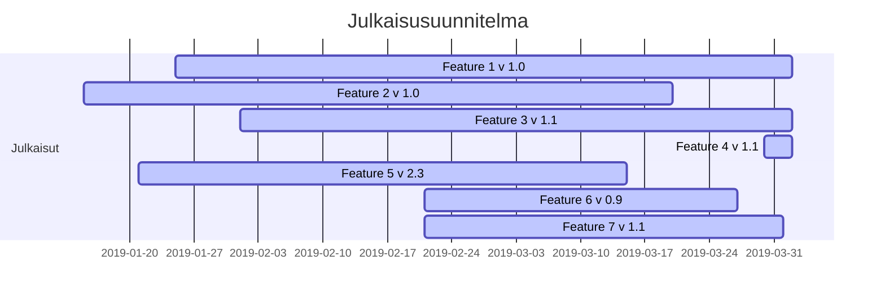

# Julkaisusuunnitelma

[](http://www.youtube.com/watch?v=ggFEhR3OZsk "")


## Gantt-kaavio PlantUML -notaatiolla

```plantuml
Project starts the 2019-5-15
[Early Adopter System Release 1.0] Starts 2019-5-15 and ends 2019-7-30
[Design Phase] Starts 2019-5-15 and ends 2019-6-15
[Feature 1  v 1.0] Starts 2019-5-25 and ends 2019-6-15
[Feature 2  v 1.0] Starts 2019-5-25 and ends 2019-7-1
[Feature 3  v 1.1] Starts 2019-6-15 and ends 2019-7-15
[Feature 4  v 1.1] Starts 2019-6-25 and ends 2019-7-20
[Feature 5  v 2.3] Starts 2019-6-1 and ends 2019-7-21
[Accceptance Testing ] Starts 2019-7-21 and ends 2019-7-23
[Fixing phase] Starts 2019-7-23 and ends 2019-7-27
[Early Adopter Enhanced System Release 1.1] Starts 2019-7-31 and ends 2019-10-30
[Early Adopter System Release 1.1] Starts 2019-10-30 and ends 2019-20 


```


## Gantt-kaavio Mermaid -notaatiolla




**Julkaisu "EarlyAdopter"**

Versio 1.0

**Konfiguraatio**

| Ominaisuus | Versio | Testattavissa | Julkaistaan |
|:-:|:-:|:-:|:-:|
| [Feature 1]() | 1.0 | x.y.201z | x+2,y+3.201z |
| [Feature 2]() | 1.0 | x.y.201z | x+2,y+3.201z |
| [Feature 3]() | 1.1 | x.y.201z | x+2,y+3.201z |
| [Feature 4]() | 1.1 | x.y.201z | x+2,y+3.201z |
| [Feature 5]() | 2.3 | x.y.201z | x+2,y+3.201z |
| [Feature 6]() | 0.9 | x.y.201z | x+2,y+3.201z |
| [Feature 7]() | 1.1 | x.y.201z | x+2,y+3.201z |


**Julkaisu "EarlyAdopter Enhanced"**

Versio 1.1

**Konfiguraatio**

| Ominaisuus | Versio | Testattavissa | Julkaistaan |
|:-:|:-:|:-:|:-:|
| [Feature 1]() | 1.0 | x.y.201z | x+2,y+3.201z |
| [Feature 2]() | 1.1 | x.y.201z | x+2,y+3.201z |
| [Feature 3]() | 1.1 | x.y.201z | x+2,y+3.201z |
| [Feature 4]() | 1.1 | x.y.201z | x+2,y+3.201z |
| [Feature 5]() | 2.5 | x.y.201z | x+2,y+3.201z |
| [Feature 6]() | 0.9 | x.y.201z | x+2,y+3.201z |
| [Feature 7]() | 1.2 | x.y.201z | x+2,y+3.201z |


**Julkaisu "EarlyAdopter Enhanced and stabilized"**

Versio 1.2

**Konfiguraatio**

| Ominaisuus | Versio | Testattavissa | Julkaistaan |
|:-:|:-:|:-:|:-:|
| [Feature 1]() | 1.0 | x.y.201z | x+2,y+3.201z |
| [Feature 2]() | 1.2 | x.y.201z | x+2,y+3.201z |
| [Feature 3]() | 1.1 | x.y.201z | x+2,y+3.201z |
| [Feature 4]() | 1.1 | x.y.201z | x+2,y+3.201z |
| [Feature 5]() | 2.5 | x.y.201z | x+2,y+3.201z |
| [Feature 6]() | 0.9 | x.y.201z | x+2,y+3.201z |
| [Feature 7]() | 1.3 | x.y.201z | x+2,y+3.201z |
